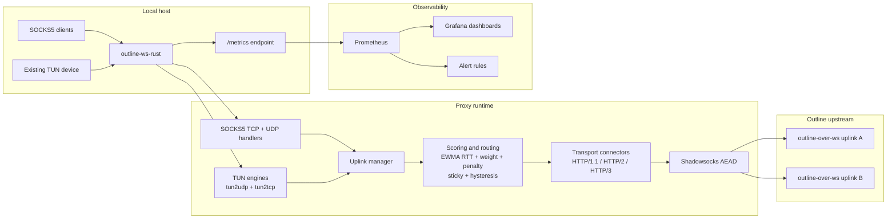

# outline-ws-rust

`outline-ws-rust` is a production-oriented Rust proxy that accepts local SOCKS5 traffic and forwards it to either Outline-compatible WebSocket transports over HTTP/1.1, HTTP/2, or HTTP/3, or to direct Shadowsocks socket uplinks.

It supports:

- SOCKS5 `CONNECT`
- SOCKS5 `UDP ASSOCIATE`
- multi-uplink failover and load balancing
- WebSocket-over-HTTP/1.1, RFC 8441 (`ws-over-h2`), and RFC 9220 (`ws-over-h3`)
- Prometheus metrics and packaged Grafana dashboards
- existing TUN device integration for `tun2udp`
- stateful `tun2tcp` relay with production-oriented guardrails

---

*Русская версия: [README.ru.md](README.ru.md)*

## Overview

At a high level, the process does five jobs:

1. Accepts local SOCKS5 and optional TUN traffic.
2. Selects the best available uplink using health probes, EWMA RTT scoring, sticky routing, hysteresis, penalties, and warm standby.
3. Connects to an Outline WebSocket transport using the requested mode (`http1`, `h2`, or `h3`) with automatic fallback.
4. Encrypts payloads using Shadowsocks AEAD before sending them upstream.
5. Exposes Prometheus metrics for runtime, uplink, probe, TUN, and `tun2tcp` behavior.

## Architecture



## Supported Features

### SOCKS5

- No-auth SOCKS5
- Optional username/password auth (`RFC 1929`)
- TCP `CONNECT`
- UDP `ASSOCIATE`
- SOCKS5 UDP fragmentation reassembly on inbound client traffic
- IPv4, IPv6, and domain-name targets
- optional bypass list for direct (non-tunneled) connections by IP prefix, file-backed with hot-reload

### Outline transports

- `ws://` and `wss://`
- HTTP/1.1 Upgrade
- RFC 8441 WebSocket over HTTP/2
- RFC 9220 WebSocket over HTTP/3 / QUIC
- direct Shadowsocks TCP/UDP socket uplinks
- transport fallback:
  - `h3 -> h2 -> http1`
  - `h2 -> http1`

### Encryption

- `chacha20-ietf-poly1305`
- `aes-128-gcm`
- `aes-256-gcm`
- `2022-blake3-aes-128-gcm`
- `2022-blake3-aes-256-gcm`
- `2022-blake3-chacha20-poly1305`

### Uplink management

- multiple uplinks
- fastest-first selection
- selection mode:
  - `active_active`: new flows can use different uplinks based on score, stickiness, and failover
  - `active_passive`: keep the current selected uplink until it becomes unhealthy or enters cooldown
- routing scope:
  - `per_flow`: decisions are made independently per routing key / target
  - `per_uplink`: one active uplink is shared process-wide per transport (`tcp` and `udp`); in `active_passive` mode the pinned TCP and UDP uplinks do not expire with `sticky_ttl`, transport-specific flows are closed if they remain attached to an older active uplink after reselection, and penalty history is not folded into the strict per-transport score
  - `global`: one shared process-wide active uplink is used for new user traffic across both `tcp` and `udp`; selection is intentionally biased toward TCP health and TCP score so UDP quality has only weak influence on which uplink becomes globally active, the active global uplink does not expire with `sticky_ttl`, strict active selection now stays pinned until the current global uplink enters cooldown, penalty history is not folded into the strict global score, and TUN flows that remain pinned to an older uplink after a global switch are actively closed so they reconnect through the new global uplink
- per-uplink static `weight`
- RTT EWMA scoring
- failure penalty model with decay
- sticky routing with TTL
- hysteresis to avoid unnecessary churn
- runtime failover
- auto-failback disabled by default (`auto_failback = false`): switches only on failure, never proactively back to a recovered primary
- warm-standby WebSocket pools for TCP and UDP

### Health probing

- WebSocket connectivity probes (TCP+TLS+WS handshake; no ping/pong — servers rarely respond to WebSocket ping control frames)
- real HTTP probes over `websocket-stream`
- real DNS probes over `websocket-packet`
- probe concurrency limits
- separate probe dial isolation
- immediate probe wakeup on runtime failure to accelerate detection
- consecutive-success counter for stable auto-failback gating

### TUN

- existing TUN device integration only
- `tun2udp` with flow lifecycle management, IPv4/IPv6 IP fragment reassembly, and local ICMP echo replies
- stateful `tun2tcp` relay with retransmit, zero-window persist/backoff, SACK-aware receive/send behavior, adaptive RTO, and bounded buffering

### Operations

- Prometheus metrics
- packaged Grafana dashboards
- packaged Prometheus alert rules
- hardened systemd unit
- Linux `fwmark` / `SO_MARK`
- IPv6-capable listeners, upstreams, probes, and SOCKS5 targets

## Current Limits

The project is intentionally practical, but there are still boundaries:

- Shadowsocks 2022 is not implemented.
- `tun2tcp` is production-oriented but still not a kernel-equivalent TCP stack.
- Non-echo ICMP traffic on TUN is not supported.
- `probe.http` supports `http://` only, not `https://`. Use `probe.tcp` for HTTPS targets.
- TCP failover is safe before useful payload exchange; live established TCP tunnels cannot be migrated transparently between uplinks.

## Repository Layout

- [`config.toml`](/Users/mmalykhin/Documents/Playground/config.toml) - example configuration
- [`systemd/outline-ws-rust.service`](/Users/mmalykhin/Documents/Playground/systemd/outline-ws-rust.service) - hardened systemd unit
- [`grafana/outline-ws-rust-dashboard.json`](/Users/mmalykhin/Documents/Playground/grafana/outline-ws-rust-dashboard.json) - main operational dashboard
- [`grafana/outline-ws-rust-tun-tcp-dashboard.json`](/Users/mmalykhin/Documents/Playground/grafana/outline-ws-rust-tun-tcp-dashboard.json) - `tun2tcp` dashboard
- `grafana/outline-ws-rust-native-burst-dashboard.json` - startup and traffic-switch burst diagnostics for native Shadowsocks mode
- [`prometheus/outline-ws-rust-alerts.yml`](/Users/mmalykhin/Documents/Playground/prometheus/outline-ws-rust-alerts.yml) - Prometheus alert rules
- [`PATCHES.md`](/Users/mmalykhin/Documents/Playground/PATCHES.md) - local vendored patch inventory

## Build

### Prerequisites

- Rust toolchain (stable): `rustup update stable`
- For cross-compilation: [`cargo-zigbuild`](https://github.com/rust-cross/cargo-zigbuild) — wraps the Zig C compiler to eliminate the need for a dedicated cross-linker per target.

```bash
cargo install cargo-zigbuild
```

Shortcuts available in this repository:

```bash
cargo release-musl-x86_64
cargo release-musl-aarch64
cargo release-router-musl-arm
cargo release-router-musl-armv7
cargo release-router-musl-aarch64
```

### CI Releases

- Every push to `main` triggers the `Nightly Release` workflow.
- CI auto-creates a tag in the form `nightly-v<current-version>-<commit-sha>`, so it is obvious which release line the nightly follows.
- That workflow publishes a GitHub `prerelease` with server `release` artifacts for `x86_64-unknown-linux-musl` and `aarch64-unknown-linux-musl`, plus a router `release-router` artifact for `aarch64-unknown-linux-musl`, and `SHA256SUMS.txt`.
- To cut a stable release, run the manual `Release` workflow and pass `major_minor` such as `1.7`.
- CI finds the latest `v1.7.*` tag, increments the patch automatically, updates `Cargo.toml` and `Cargo.lock`, creates a release commit, pushes tag `v1.7.Z`, and publishes a full GitHub Release in the same workflow run.
- The stable release now includes both server `release` assets for `x86_64-unknown-linux-musl` and `aarch64-unknown-linux-musl`, and router `release-router` assets for `aarch64-unknown-linux-musl`, `mips-unknown-linux-musl`, and `mipsel-unknown-linux-musl`.
- Router archives are named `outline-ws-rust-router-v<version>-<target>.tar.gz` so they are distinct from the regular server assets.
- Pushing a tag like `v1.2.3` manually still triggers the `Tag Release` workflow as a separate external tag-driven path.

Install the required Rust targets:

```bash
# VMs / servers
rustup target add x86_64-unknown-linux-musl
rustup target add aarch64-unknown-linux-musl

# Routers (ARM, e.g. Raspberry Pi, many modern home routers)
rustup target add armv7-unknown-linux-musleabihf
# Routers (AArch64, e.g. newer Raspberry Pi, Banana Pi, routers with Cortex-A53+)
rustup target add aarch64-unknown-linux-musl
```

Current stable Rust no longer ships `mips-unknown-linux-musl` or `mipsel-unknown-linux-musl` as downloadable `rust-std` targets, so local shortcuts only cover the targets still available on stable. Legacy MIPS builds now require a pinned older toolchain or a custom `build-std` flow; official stable release assets for those targets are produced in the `Release` CI workflow.

---

### Feature flags

The binary is controlled by Cargo feature flags. Mix and match as needed:

| Feature | Default | Effect |
|---|---|---|
| `h3` | ✓ | Include H3/QUIC transport (pulls in quinn + sockudo-ws/http3) |
| `metrics` | ✓ | Include Prometheus metrics endpoint (pulls in prometheus + serde_json) |
| `router` | — | Convenience alias for `--no-default-features --features router` (disables the default optional features above) |

> **Why disable for routers:** `h3`/QUIC adds ~1–2 MB of binary size and runtime overhead on MIPS/ARM. `metrics` adds prometheus + serde_json and a background sampling task. The `router` feature removes both at once.

---

### Virtual machines and servers

Native build for the current machine (fastest, uses all CPU features):

```bash
cargo build --release
```

Static x86-64 binary (runs on any Linux x86-64 without glibc dependency):

```bash
cargo zigbuild --release --target x86_64-unknown-linux-musl
# or shorter
cargo release-musl-x86_64
```

Static AArch64 binary (ARM64 servers, AWS Graviton, Ampere):

```bash
cargo zigbuild --release --target aarch64-unknown-linux-musl
# or shorter
cargo release-musl-aarch64
```

To disable only one feature while keeping others (e.g. strip metrics but keep H3):

```bash
cargo zigbuild --release --no-default-features --features h3 --target x86_64-unknown-linux-musl
```

---

### Routers (cross-compilation)

All router builds use `musl` libc for a fully static binary with no runtime dependencies.
Use `config-router.toml` on the device — see [Router Configuration](#router-configuration).

All router builds use `--no-default-features --features router` which disables:
- `h3` → removes quinn, h3, h3-quinn, sockudo-ws/http3 (~1–2 MB smaller on MIPS)
- `metrics` → removes prometheus, serde_json, background process sampler

Router builds use the `release-router` cargo profile (`opt-level = "z"`) which prioritises binary size over throughput. The default `release` profile uses `opt-level = 3` (maximum speed) and is the right choice for VMs.

**ARM soft-float** (minimal ARM routers without FPU, e.g. older D-Link DIR, Linksys WRT):

```bash
cargo zigbuild --profile release-router --no-default-features --features router --target arm-unknown-linux-musleabi
# or shorter
cargo release-router-musl-arm
```

**ARMv7 hard-float** (Raspberry Pi 2/3 in 32-bit mode, many mid-range routers):

```bash
cargo zigbuild --profile release-router --no-default-features --features router --target armv7-unknown-linux-musleabihf
# or shorter
cargo release-router-musl-armv7
```

**AArch64 / ARM64** (Raspberry Pi 3/4/5 in 64-bit mode, Banana Pi R3/R4, NanoPi R5S, routers with MT7986/MT7988, IPQ8074):

```bash
cargo zigbuild --profile release-router --no-default-features --features router --target aarch64-unknown-linux-musl
# or shorter
cargo release-router-musl-aarch64
```

The compiled binary is placed in `target/<target>/release-router/outline-ws-rust`.
Copy it to the router and make it executable:

```bash
scp target/armv7-unknown-linux-musleabihf/release-router/outline-ws-rust root@192.168.1.1:/usr/local/bin/
ssh root@192.168.1.1 chmod +x /usr/local/bin/outline-ws-rust
```

> The `router` feature is a convenience alias — it sets no flags itself; it just exists so `--features router` is a memorable shorthand for `--no-default-features`.

### Router Release Assets

Stable Rust no longer provides prebuilt `rust-std` for `mips-unknown-linux-musl` / `mipsel-unknown-linux-musl`, so these builds now need nightly plus `build-std`. For local builds you still need a working MIPS musl-capable C toolchain (or equivalent Zig wrapper setup); the easiest reliable path for official stable artifacts is the `Release` CI flow.

Local example, assuming you already have a working MIPS musl C toolchain:

```bash
rustup toolchain install nightly --component rust-src
cargo +nightly build -Z build-std=std,panic_abort --profile release-router --no-default-features --features router --target mipsel-unknown-linux-musl
```

CI / release example:

- Run the manual `Release` workflow for the normal stable release, or push a tag like `v1.2.3` for the external tag-driven path.
- The `Release` workflow publishes one GitHub Release for both server and router assets.
- For `aarch64-unknown-linux-musl`, router binaries are built with `cargo-zigbuild`.
- For `mips` and `mipsel`, CI uses nightly `build-std`, Zig, and generated compiler wrapper scripts mapped to Zig's musl EABI targets instead of downloading an external toolchain archive.
- The published router assets are named `outline-ws-rust-router-v<version>-<target>.tar.gz`.

---

### Router Configuration

Use `config-router.toml` as a starting point for memory-constrained devices.
Key differences from the default VM config:

**Compile-time (feature flags):**

| Feature | VM default | Router (`--no-default-features --features router`) |
|---|---|---|
| `h3` | ✓ enabled | ✗ → H3 silently falls back to H2 |
| `metrics` | ✓ enabled | ✗ → all metrics calls are no-ops, no `/metrics` endpoint |
| `env-filter` | ✓ enabled | ✗ → log level hardcoded to `WARN` (saves ~300 KB, no regex) |
| `multi-thread` | ✓ enabled | ✗ → always `current_thread` scheduler (saves ~100–200 KB) |

**Runtime (config / CLI):**

| Parameter | VM default | Router example |
|---|---|---|
| `RUST_LOG` env | configurable (default: `info,outline_ws_rust=debug`) | hardcoded `WARN` (no regex) |
| `--worker-threads` | CPU count | N/A (always `current_thread`) |
| `--thread-stack-size-kb` | 2048 KiB | N/A (`multi-thread` disabled) |
| `udp_recv_buf_bytes` | kernel default | e.g. `212992` (208 KiB) |
| `udp_send_buf_bytes` | kernel default | e.g. `212992` (208 KiB) |
| `tun.max_flows` | 4096 | 128 |
| `tun.defrag_max_fragment_sets` | 1024 | 64 |
| `tun.defrag_max_fragments_per_set` | 64 | 16 |
| `tun.defrag_max_total_bytes` | 16 MiB | 2 MiB |
| `tun.defrag_max_bytes_per_set` | 128 KiB | 16 KiB |
| `tun.tcp.max_pending_server_bytes` | 4 MiB | 64 KiB |
| `tun.tcp.max_buffered_client_bytes` | 256 KiB | 64 KiB |
| `[h2] initial_stream_window_size` | 1 MiB | 256 KiB |
| `[h2] initial_connection_window_size` | 2 MiB | 512 KiB |
| Warm standby | 1 TCP + 1 UDP | disabled |
| Load balancing mode | `active_active` | `active_passive` |
| Transport mode | `h3` | `h2` (QUIC is heavy on MIPS/ARM) |

Run with the router config:

```bash
outline-ws-rust --config /etc/outline-ws-rust/config-router.toml --worker-threads 1
```

Or via environment variables:

```bash
PROXY_CONFIG=/etc/outline-ws-rust/config-router.toml WORKER_THREADS=1 outline-ws-rust
```

> Router builds log at `WARN` level unconditionally — `RUST_LOG` is ignored. To get dynamic log levels, add `--features env-filter` to the build command (at the cost of ~300 KB on MIPS).

## Quick Start

Minimal local run using `config.toml`:

```bash
cargo run --release
```

Example one-shot CLI override:

```bash
cargo run --release -- \
  --listen [::]:1080 \
  --tcp-ws-url wss://example.com/SECRET/tcp \
  --tcp-ws-mode h3 \
  --udp-ws-url wss://example.com/SECRET/udp \
  --udp-ws-mode h3 \
  --method chacha20-ietf-poly1305 \
  --password 'Secret0'
```

Example client settings:

- SOCKS5 host: `::1` or `127.0.0.1`
- SOCKS5 port: `1080`

For `listen = "[::]:1080"`, many systems create a dual-stack listener. If your platform does not map IPv4 to IPv6 sockets, bind an additional IPv4 listener instead.

## Configuration

By default the process reads [`config.toml`](/Users/mmalykhin/Documents/Playground/config.toml).

Example:

```toml
[socks5]
# Optional. If omitted, the SOCKS5 listener is disabled.
listen = "[::]:1080"
# Optional local SOCKS5 auth for clients.
#
# [[socks5.users]]
# username = "alice"
# password = "secret1"
#
# [[socks5.users]]
# username = "bob"
# password = "secret2"

[metrics]
listen = "[::1]:9090"

[tun]
# Existing TUN device path. Creation, IP addresses and routes stay outside the app.
# Linux example:
# path = "/dev/net/tun"
# name = "tun0"
# macOS / BSD example:
# path = "/dev/tun0"
# mtu = 1500
# max_flows = 4096
# idle_timeout_secs = 300

# [tun.tcp]
# connect_timeout_secs = 10
# handshake_timeout_secs = 15
# half_close_timeout_secs = 60
# max_pending_server_bytes = 4194304
# backlog_abort_grace_secs = 3
# backlog_hard_limit_multiplier = 2
# backlog_no_progress_abort_secs = 8
# max_buffered_client_segments = 4096
# max_buffered_client_bytes = 262144
# max_retransmits = 12

[probe]
interval_secs = 30
timeout_secs = 10
max_concurrent = 4
max_dials = 2
min_failures = 1

[probe.ws]
enabled = true

[probe.http]
url = "http://example.com/"

`probe.http` sends an HTTP `HEAD` request, not `GET`, so health checks do not download response bodies through the uplink.

[probe.dns]
server = "1.1.1.1"
port = 53
name = "example.com"

[probe.tcp]
host = "example.com"
port = 80

[load_balancing]
mode = "active_active"
routing_scope = "per_flow"
warm_standby_tcp = 1
warm_standby_udp = 1
sticky_ttl_secs = 300
hysteresis_ms = 50
failure_cooldown_secs = 10
rtt_ewma_alpha = 0.3
failure_penalty_ms = 500
failure_penalty_max_ms = 30000
failure_penalty_halflife_secs = 60
h3_downgrade_secs = 60
# auto_failback = false   # default: switch only on failure, never proactively back to primary

[[uplinks]]
name = "primary"
transport = "websocket"
tcp_ws_url = "wss://example.com/SECRET/tcp"
weight = 1.0
tcp_ws_mode = "h3"
# fwmark = 100
# ipv6_first = true
udp_ws_url = "wss://example.com/SECRET/udp"
udp_ws_mode = "h3"
method = "chacha20-ietf-poly1305"
password = "Secret0"

[[uplinks]]
name = "backup"
transport = "websocket"
tcp_ws_url = "wss://backup.example.com/SECRET/tcp"
weight = 0.8
tcp_ws_mode = "h2"
udp_ws_url = "wss://backup.example.com/SECRET/udp"
udp_ws_mode = "h2"
method = "chacha20-ietf-poly1305"
password = "Secret0"

[[uplinks]]
name = "direct-ss"
transport = "shadowsocks"
tcp_addr = "ss.example.com:8388"
udp_addr = "ss.example.com:8388"
method = "chacha20-ietf-poly1305"
password = "Secret0"
```

### Key config behavior

- `transport` accepts `websocket` (default) or `shadowsocks`.
- At least one ingress must be configured: `--listen` / `[socks5].listen` and/or `[tun]`. If neither is present, the process exits with an error instead of silently binding `127.0.0.1:1080`.
- `tcp_ws_mode` / `udp_ws_mode` accept `http1`, `h2`, or `h3` and are only used with `transport = "websocket"`.
- `tcp_addr` / `udp_addr` are used with `transport = "shadowsocks"` and accept `host:port` or `[ipv6]:port`.
- `ipv6_first` (default `false`) changes resolved-address preference for that uplink from IPv4-first to IPv6-first for TCP, UDP, H1, H2, and H3 connections.
- `method` also accepts `2022-blake3-aes-128-gcm`, `2022-blake3-aes-256-gcm`, and `2022-blake3-chacha20-poly1305`; for these methods `password` must be a base64-encoded PSK of the exact cipher key length.
- `[[socks5.users]]` enables local SOCKS5 username/password auth for multiple users. Each entry must include both `username` and `password`.
- `[socks5] username` + `password` is still accepted as a shorthand for a single user.
- CLI/env equivalents `--socks5-username` / `SOCKS5_USERNAME` and `--socks5-password` / `SOCKS5_PASSWORD` also configure a single user.
- `[probe] min_failures` (default `1`): consecutive probe failures required before an uplink is declared unhealthy. Increase to `2` or `3` to tolerate intermittent probe blips without triggering failover. The same value also sets the consecutive-success stability threshold for `auto_failback`.
- `[load_balancing] auto_failback` (default `false`): controls whether the proxy proactively returns traffic to a recovered higher-priority uplink.
  - `false` (default): the active uplink is replaced **only when it fails**. Once on a backup, the proxy stays there until the backup itself fails — no automatic return to primary. Recommended for production use to prevent unnecessary connection disruption.
  - `true`: when the current active is healthy and a candidate with a **higher `weight`** (or equal weight and lower config index) exists, the proxy may return traffic to that candidate — but only after the candidate has accumulated `min_failures` consecutive successful probe cycles. Priority is determined by `weight`, not EWMA RTT: this prevents spurious switches under load, when the active uplink's EWMA temporarily inflates due to slow connections while an idle backup looks better by latency. Failback always moves toward higher weight (`1.0 → 1.5 → 2.0`): switching to a lower-weight uplink via auto_failback is not possible — that requires a probe-confirmed failover.
- `[load_balancing] h3_downgrade_secs` (default `60`): how long an uplink that experienced an H3 application-level error (e.g. `H3_INTERNAL_ERROR`) stays in H2 fallback mode before H3 is retried. Set to `0` to disable automatic H3 downgrade.
- The canonical config format is `probe`, `load_balancing`, and `uplinks` without the `outline.` prefix.
- The legacy `[outline]` format is still accepted for backward compatibility, and remains the least confusing way to express a single-uplink shorthand TOML config.
- CLI flags and environment variables can override file settings.
- `--metrics-listen` can enable metrics even if `[metrics]` is not present.
- `--tun-path` can enable TUN even if `[tun]` is not present.

### Useful CLI and env overrides

- `--config` / `PROXY_CONFIG`
- `--listen` / `SOCKS5_LISTEN`
- `--socks5-username` / `SOCKS5_USERNAME`
- `--socks5-password` / `SOCKS5_PASSWORD`
- `--tcp-ws-url` / `OUTLINE_TCP_WS_URL`
- `--tcp-ws-mode` / `OUTLINE_TCP_WS_MODE`
- `--udp-ws-url` / `OUTLINE_UDP_WS_URL`
- `--udp-ws-mode` / `OUTLINE_UDP_WS_MODE`
- `--method` / `SHADOWSOCKS_METHOD`
- `--password` / `SHADOWSOCKS_PASSWORD`
- `--metrics-listen` / `METRICS_LISTEN`
- `--tun-path` / `TUN_PATH`
- `--tun-name` / `TUN_NAME`
- `--tun-mtu` / `TUN_MTU`
- `--fwmark` / `OUTLINE_FWMARK`

## SOCKS5 Bypass

The `[bypass]` section lets you route selected SOCKS5 TCP and UDP connections directly to the internet instead of through the tunnel. Matching is done on the resolved IP address; domain-name targets are never bypassed.

### Bypass config

```toml
[bypass]
# Load prefixes from a file (one CIDR per line; # comments and blank lines ignored).
file = "/etc/outline-ws-rust/bypass.txt"
# How often to poll the file for mtime changes and reload it (default: 60 s).
file_poll_secs = 60

# Inline prefixes — combined with `file` if both are set.
# prefixes = ["10.0.0.0/8", "192.168.0.0/16", "172.16.0.0/12", "fc00::/7"]

# Inverted mode: bypass everything NOT in the list (only listed prefixes go through the tunnel).
# invert = false  # default
```

### Bypass file format

One CIDR per line. `#` comments and blank lines are ignored. Both IPv4 and IPv6 prefixes are accepted.

```
# RFC 1918 private ranges
10.0.0.0/8
172.16.0.0/12
192.168.0.0/16

# IPv6 ULA
fc00::/7

# Country-level blocks (example)
100.43.72.0/24
2001:1428::/32
2001:1900:5:2:2::4841/128
```

### How hot-reload works

A background tokio task polls the file's `mtime` every `file_poll_secs` seconds. When a change is detected the file is re-read and the in-memory prefix list is atomically replaced via `Arc<RwLock<>>`. Read-side lookup (per new SOCKS5 connection) holds a shared read-lock for the duration of a single `is_bypassed` call — typically a few microseconds. On reload error the previous list is kept and a warning is logged.

### Prefix matching

Internally prefixes are converted to sorted `[start, end]` integer ranges (IPv4 as `u32`, IPv6 as `u128`), with overlapping and adjacent ranges merged. Lookup uses `partition_point` (binary search) — O(log n), no extra dependencies, cache-friendly linear memory.

### Inverted mode

Set `invert = true` to tunnel only the listed prefixes and bypass everything else. Useful when the tunnel list is small and the bypass list is the majority of traffic.

## Transport Modes

### HTTP/1.1

Use when you want the most compatible baseline behavior.

### HTTP/2

Use when the upstream supports RFC 8441 Extended CONNECT for WebSockets.

### HTTP/3

Use when the upstream supports RFC 9220 and QUIC/UDP is available end to end.

Recommended operator stance:

- prefer `http1` as a conservative baseline
- enable `h2` only when the reverse proxy and origin are known-good for RFC 8441
- enable `h3` only when QUIC is explicitly supported and reachable

**Shared QUIC endpoint:** H3 connections that do not use a per-uplink `fwmark` share a single UDP socket per address family (one for IPv4, one for IPv6). This means N warm-standby H3 connections do not open N UDP sockets. Connections that require a specific `fwmark` still use their own dedicated socket because the mark must be applied before the first `sendmsg`.

QUIC keep-alive pings are sent every 10 seconds to prevent NAT mapping expiry and to allow the server to detect dead connections without waiting for the full idle timeout.

Runtime fallback behavior:

- requested `h3` tries `h3`, then `h2`, then `http1`
- requested `h2` tries `h2`, then `http1`

**H3 runtime downgrade:** when any TCP runtime failure occurs on an H3-configured uplink (connection reset, stream error, QUIC transport error, `H3_INTERNAL_ERROR`, timeout, or any other upstream TCP failure), the uplink automatically falls back to H2 for new TCP connections for the duration configured by `h3_downgrade_secs` (default: 60 seconds). After the downgrade window expires, H3 is retried by the next real connection. This prevents reconnect storms where every new flow establishes an H3 connection only to have it fail shortly after.

The same downgrade is also triggered by TCP probe failures on H3 uplinks, preventing probe-driven flapping in `active_passive + global` mode: without this, intermittent H3 probe pass/fail alternation would cause a failover switch every probe cycle.

Probe behavior during a downgrade window:
- Probes use `effective_tcp_ws_mode`, which returns H2 while `h3_tcp_downgrade_until` is active. The probe therefore tests H2 connectivity during the window rather than continuing to stress-test broken H3.
- A successful probe during the window does **not** clear `h3_tcp_downgrade_until`. H3 recovery is tested naturally once the timer expires and the next real connection attempts H3. If that attempt fails, the timer is reset.

Scoring during a downgrade window (`per_flow` scope):
- While `h3_tcp_downgrade_until` is active, the uplink's effective latency score has `failure_penalty_max` added on top of the normal failure penalty. This prevents `active_active + per_flow` flows from switching back to the primary uplink while it is operating in H2 fallback mode: as the normal failure penalty decays, the extra downgrade penalty keeps the primary's score unfavorable until the window closes.

Warm-standby connections respect the active downgrade state: while an uplink is in H3→H2 downgrade, new standby slots are filled using H2.

## Uplink Selection and Runtime Behavior

Each uplink has its own:

- TCP URL and mode
- UDP URL and mode
- cipher and password
- optional Linux `fwmark`
- optional relative routing preference via `weight`

Selection pipeline:

1. Health probes update the latest raw RTT and EWMA RTT.
2. Probe-confirmed failures add a decaying failure penalty. When probes are enabled, runtime failures (e.g. an H3 connection reset under load) do not add a penalty on their own — they only set a temporary cooldown. The penalty is added only when a probe confirms a real failure (`consecutive_failures ≥ min_failures`). This prevents penalty accumulation on a healthy uplink due to transient errors under load.
3. Effective latency is derived from EWMA RTT plus current penalty.
4. Final score is `effective_latency / weight`.
5. Sticky routing and hysteresis reduce avoidable switches.
6. Warm-standby pools reduce connection setup latency.

Routing scope behavior:

- `per_flow`: different targets can choose different uplinks
- `per_uplink`: one selected uplink is shared per transport, so TCP and UDP may still use different uplinks; in `active_passive` mode each transport keeps its own pinned active uplink until failover or explicit reselection, and penalties no longer bias the strict transport score
- `global`: one selected uplink is shared across all new user traffic until failover or explicit reselection, with TCP health and TCP score taking priority over UDP quality; in this mode strict selection stays pinned to the current active uplink until it enters cooldown, penalties no longer bias the strict global score, and UDP traffic no longer falls through to a backup uplink while the current global uplink is still the active TCP choice

**Auto-failback behavior:** controlled by `load_balancing.auto_failback` (default `false`).

- `false` (default): the active uplink is **only replaced when it fails** (enters cooldown or is no longer healthy). While the active uplink is still healthy, it stays active regardless of whether a higher-priority uplink has recovered. This is the recommended setting for production because it avoids connection disruption caused by proactive primary preference.
- `true`: when the current active uplink is healthy and a probe-healthy candidate with a higher `weight` (or equal weight and lower config index) exists, the proxy may return traffic to that candidate — but only after the candidate has accumulated `min_failures` consecutive successful probe cycles. Priority is determined by `weight`, not EWMA: this prevents spurious switches under load, when the active uplink's EWMA is temporarily elevated. Failback only moves toward higher weight; switching to a lower-weight uplink requires a probe-confirmed failover.

**Penalty-aware failover:** when the current active uplink enters cooldown and the selector must pick a replacement, candidates are re-sorted with penalty-aware scoring (EWMA RTT + decaying failure penalty / weight). This prevents oscillation with three or more uplinks: without penalties, a probe-cleared primary with a better raw EWMA would be selected again immediately even though it just failed, causing rapid back-and-forth. With penalties, a fresher backup with a higher raw RTT wins over the recently-failed primary until the penalty decays.

Runtime failover:

- UDP can switch uplinks within an active association after runtime send/read failure.
- TCP can fail over before a usable tunnel is established.
- Established TCP tunnels are not live-migrated.

## Health Probes

Available probe types:

- `ws`: verifies TCP+TLS+WebSocket handshake connectivity to the uplink. No WebSocket ping/pong frames are sent — many servers do not respond to WebSocket ping control frames. Confirms that a new connection can be established; data-path integrity is verified by HTTP/DNS/TCP probes.
- `http`: real HTTP `HEAD` request over `websocket-stream` — verifies the full TCP data path. Only `http://` URLs are supported.
- `dns`: real DNS exchange over `websocket-packet` — verifies the full UDP data path.
- `tcp`: opens a full SS tunnel to a configured `host:port` and waits for any data or a clean close from the remote. Verifies the complete TCP data path through the Shadowsocks server, unlike `ws` which only confirms port-level reachability. Use any reliably reachable TCP host (e.g. `example.com:80`, `1.1.1.1:443`).

Probe execution controls:

- `max_concurrent`: total concurrent probe tasks
- `max_dials`: dedicated cap for probe dial attempts
- `min_failures`: consecutive probe failures required before the uplink is marked unhealthy (default: `1`). Also used as the consecutive-success threshold for auto-failback stability: when `auto_failback = true`, a recovered primary must accumulate `min_failures` consecutive probe successes before traffic can be returned to it.
- `attempts`: number of probe attempts per uplink per cycle. Each attempt that fails increments the consecutive-failure counter; a passing attempt resets it to zero and increments the consecutive-success counter.

Probe timing:

- Probes normally run on a fixed `interval` timer.
- When a runtime failure sets a fresh failure cooldown on an uplink, the probe loop is immediately woken up (via an internal `Notify`) so that failover is confirmed within one probe cycle rather than waiting for the next scheduled interval. This significantly reduces end-to-end failover latency.
- **Probe suppression under active traffic (global + probe):** in `routing_scope = global` mode with probes enabled, the probe cycle is skipped for an uplink when all three conditions are met: (1) real traffic was observed within the last `interval`, (2) the uplink is probe-healthy (`tcp_healthy = true`), (3) routing scope is `global`. Active traffic is stronger evidence of reachability than a probe ping. This prevents false-negative probe results under load: when the probe loop wakes immediately after an H3 runtime failure, the server may be busy and unable to accept a new QUIC connection for the probe — which would otherwise cause a spurious failover. For non-global scopes the probe still runs even when traffic is active, to confirm recovery after cooldown.

Warm-standby validation:

- Every 15 seconds, standby connections are validated using a 1 ms non-blocking read. If the server closed the connection (EOF, close frame, or error), the slot is cleared and refilled. A timeout (no data in 1 ms) means the connection is still open.

Probe activation rules:

- probes do not start unless probe settings are explicitly configured
- `[probe]` alone does not enable any check
- at least one of `[probe.ws]`, `[probe.http]`, `[probe.dns]`, or `[probe.tcp]` must be present

Uplinks without a `udp_ws_url` are treated as TCP-only: UDP health state and standby slots are not created or tracked for them, and UDP-related probe outcomes do not affect their UDP health metric.

## IPv6

Supported:

- SOCKS5 IPv6 targets
- IPv6 literal upstream URLs such as `wss://[2001:db8::10]/SECRET/tcp`
- IPv6 probes
- IPv6 listeners
- IPv6 UDP packets in TUN mode
- IPv6 upstream transport for `h2` and `h3`

## TUN Mode

The process attaches only to an already existing TUN device. Interface creation, addresses, routing, and policy routing stay outside the app.

### tun2udp

Capabilities:

- IPv4 and IPv6 UDP packet forwarding
- IPv4 and IPv6 IP fragment reassembly on the TUN ingress path
- local IPv4 ICMP echo reply (`ping`) handling
- local IPv6 ICMPv6 echo reply handling, with source fragmentation to the IPv6 minimum MTU when needed
- IPv6 UDP and ICMPv6 handling across supported extension-header paths
- per-flow uplink transport
- flow idle cleanup
- bounded flow count
- oldest-flow eviction on overflow
- flow metrics and packet outcome metrics, including local ICMP replies

### tun2tcp

Capabilities:

- stateful userspace TCP relay over Outline TCP uplinks
- SYN / SYN-ACK / FIN / RST handling
- out-of-order buffering
- receive-window enforcement
- SACK-aware receive/send logic
- adaptive RTO
- zero-window persist/backoff
- bounded buffering and retransmit budgets
- flow termination on timeout, overflow, or relay failure
- transport-error reporting to the uplink penalty system: abrupt upstream closes (e.g. QUIC `APPLICATION_CLOSE` / `H3_INTERNAL_ERROR`) are forwarded to `report_runtime_failure`, so the H3→H2 downgrade and failure penalty apply to TUN TCP flows the same way they apply to SOCKS5 flows; clean WebSocket closes (FIN or Close frame) are not counted as failures

This is intended for real operations, but it is still not equivalent to a kernel TCP stack.

## Linux fwmark

Per-uplink `fwmark` applies `SO_MARK` to outbound sockets:

- HTTP/1.1 WebSocket TCP sockets
- HTTP/2 WebSocket TCP sockets
- HTTP/3 QUIC UDP sockets
- probe dials
- warm-standby connections

Requirements:

- Linux only
- `CAP_NET_ADMIN`

## Metrics and Dashboards

If metrics are enabled, the process serves:

- `/metrics` - Prometheus text exposition

Example:

```bash
curl http://[::1]:9090/metrics
```

Prometheus example:

```yaml
scrape_configs:
  - job_name: outline-ws-rust
    metrics_path: /metrics
    static_configs:
      - targets:
          - "[::1]:9090"
```

Metrics include:

- build and startup info
- process resident memory and heap usage gauges
- SOCKS5 requests and active sessions
- session duration histogram
- rolling session p95 gauge
- payload bytes and UDP datagrams
- oversized UDP drop counters for incoming client packets and outgoing client responses
- uplink health, latency, EWMA RTT, penalties, score, cooldown, standby readiness. `uplink_health` is exported as `1` (healthy) or `0` (unhealthy) only when the probe has run and confirmed a state. Before the first probe cycle the metric is absent — an empty value means "unknown", not unhealthy.
- per-uplink consecutive TCP/UDP failure counters and consecutive-success counters
- per-uplink H3 downgrade state (remaining downgrade window in milliseconds)
- probe results and latency
- warm-standby acquire and refill outcomes
- TUN flow and packet metrics
- `tun2tcp` retransmit, backlog, window, RTT, and RTO metrics

On Linux, the process memory sampler updates:

- `outline_ws_rust_process_resident_memory_bytes`
- `outline_ws_rust_process_virtual_memory_bytes`
- `outline_ws_rust_process_heap_memory_bytes`
- `outline_ws_rust_process_heap_allocated_bytes`
- `outline_ws_rust_process_heap_free_bytes`
- `outline_ws_rust_process_heap_mode_info{mode}`
- `outline_ws_rust_process_open_fds`
- `outline_ws_rust_process_threads`

Heap metrics currently fall back to `VmData`-based estimation on Linux and export `heap_mode_info{mode="estimated"}`.
`heap_free_bytes` remains `0` because the current sampling path does not expose allocator-specific free-heap accounting.

On Linux, the process also emits a periodic descriptor inventory log:

- `process fd snapshot`

The descriptor snapshot includes total open FDs plus a breakdown for sockets, pipes, anon inodes, regular files, and other descriptor types.
The main dashboard now has a dedicated `Memory & Allocator` section with `Current RSS`, `Current Virtual`, `Heap Allocated`, `Allocator Heap Mode`, `Process Memory`, `Allocator Heap State`, `Heap to RSS Ratio`, and `RSS to Virtual Ratio`. FD, thread, and transport pressure remain in a separate section so allocator behavior is visible without mixing it with descriptor churn.

When runtime failure storms are suppressed because an uplink is already in cooldown, `outline_ws_rust_uplink_runtime_failures_suppressed_total{transport,uplink}` and the `Suppressed Runtime Failures` panel show how much duplicate failure churn was intentionally ignored.
`outline_ws_rust_selection_mode_info{mode}`, `outline_ws_rust_routing_scope_info{scope}`, `outline_ws_rust_global_active_uplink_info{uplink}`, and `outline_ws_rust_sticky_routes_total` feed the `Selection Mode`, `Routing Scope`, `Global Active Uplink`, and `Global Sticky Routes` stat panels so you can confirm how the selector is configured and, in `global` scope, whether a sticky active uplink is currently pinned.
When TUN UDP forwarding fails before a packet can be delivered upstream, `outline_ws_rust_tun_udp_forward_errors_total{reason}` and the `UDP Forward Errors` panel break that down into `all_uplinks_failed`, `transport_error`, `connect_failed`, and `other`.
Oversized SOCKS5 UDP packets dropped before uplink forwarding, and oversized UDP responses dropped before client delivery, are exported as `outline_ws_rust_udp_oversized_dropped_total{direction="incoming|outgoing"}` and visualized in the `Oversized UDP Drops` panel.
Local ICMP echo handling is exported separately via `outline_ws_rust_tun_icmp_local_replies_total{ip_family}` and visualized in the `Local ICMP Replies` panel.
The `Active UDP Flows` panel shows current TUN UDP flow count alongside configured capacity, `UDP Flow Pressure Ratio` is a quick stat+spline indicator of how close the current UDP flow table is to its limit, and `UDP Flow Lifecycle` shows whether active flow growth comes from normal creation outpacing closure (`created > closed`) or from cleanup not keeping up with the current traffic mix.

For direct `transport = "shadowsocks"` UDP uplinks, the same oversized checks still apply on the local relay boundaries:

- incoming: the relay drops the packet if `target + payload` exceeds the Shadowsocks AEAD payload limit before encrypting and sending it to the uplink
- outgoing: the relay drops the packet if the decoded upstream response becomes larger than a safe SOCKS5 UDP datagram before sending it back to the client

Dashboards:

- [`grafana/outline-ws-rust-dashboard.json`](/Users/mmalykhin/Documents/Playground/grafana/outline-ws-rust-dashboard.json)
- [`grafana/outline-ws-rust-tun-tcp-dashboard.json`](/Users/mmalykhin/Documents/Playground/grafana/outline-ws-rust-tun-tcp-dashboard.json)
- `grafana/outline-ws-rust-native-burst-dashboard.json`

The main dashboard is grouped into:

- Overview
- Routing Policy
- Traffic
- Latency
- Health & Routing
- Memory & Allocator
- FD, Threads & Transport Pressure
- Probes & Standby
- TUN

Traffic panels on the main dashboard now break payload throughput down by `uplink`, so active traffic split between `nuxt` and `senko` is visible directly in `Payload by Uplink (Selected Range)` and `Protocol Throughput`.

The `tun2tcp` dashboard is grouped into:

- Overview
- Recovery & Loss
- Backlog & Flow State
- Timing & Window Control

Both dashboards use a shared color language: blue for traffic and baseline timing, amber for pressure or degraded latency, red for failures and loss, and green for healthy capacity or successful standby behavior.
Legends also use a shared ordering convention: `instance`, then `uplink` when present, then the metric or event name. The `instance` label is shortened to the part before the first dot to keep legends compact.
`outline_ws_rust_allocator_info{allocator=...}` exports the selected allocator explicitly, and the main dashboard shows it in the `Allocator` panel so you can confirm which allocator build is running.

Alert rules:

- [`prometheus/outline-ws-rust-alerts.yml`](/Users/mmalykhin/Documents/Playground/prometheus/outline-ws-rust-alerts.yml)

## Systemd Deployment

The repository includes a hardened unit:

- [`systemd/outline-ws-rust.service`](/Users/mmalykhin/Documents/Playground/systemd/outline-ws-rust.service)

Key operational notes:

- `PrivateDevices=false` is required for host TUN access.
- Keep `AmbientCapabilities=CAP_NET_ADMIN` and `CapabilityBoundingSet=CAP_NET_ADMIN` when using `fwmark`.
- `RUST_LOG=info` is already set in the unit.

Typical deployment layout:

- binary: `/usr/local/bin/outline-ws-rust`
- config: `/etc/outline-ws-rust/config.toml`
- working state: `/var/lib/outline-ws-rust`

## Testing

Useful local checks:

```bash
cargo check
cargo test
```

Manual real-upstream integration tests exist for HTTP/2 and HTTP/3:

```bash
RUN_REAL_SERVER_H2=1 \
OUTLINE_TCP_WS_URL='wss://example.com/SECRET/tcp' \
OUTLINE_UDP_WS_URL='wss://example.com/SECRET/udp' \
SHADOWSOCKS_PASSWORD='Secret0' \
cargo test --test real_server_h2 -- --nocapture
```

```bash
RUN_REAL_SERVER_H3=1 \
OUTLINE_TCP_WS_URL='wss://example.com/SECRET/tcp' \
OUTLINE_UDP_WS_URL='wss://example.com/SECRET/udp' \
SHADOWSOCKS_PASSWORD='Secret0' \
cargo test --test real_server_h3 -- --nocapture
```

There is also a dedicated warm-standby integration test:

```bash
cargo test --test standby_validation -- --nocapture
```

## Protocol References

- [Outline `outline-ss-server`](https://github.com/Jigsaw-Code/outline-ss-server)
- [Shadowsocks AEAD specification](https://shadowsocks.org/doc/aead.html)
- [RFC 8441: Bootstrapping WebSockets with HTTP/2](https://datatracker.ietf.org/doc/html/rfc8441)
- [RFC 9220: Bootstrapping WebSockets with HTTP/3](https://datatracker.ietf.org/doc/html/rfc9220)

## Local Patch Tracking

Vendored dependency patches are tracked in:

- [`PATCHES.md`](/Users/mmalykhin/Documents/Playground/PATCHES.md)

This is the source of truth for local deviations from upstream crates, including the vendored `h3` patch used for RFC 9220 support.
