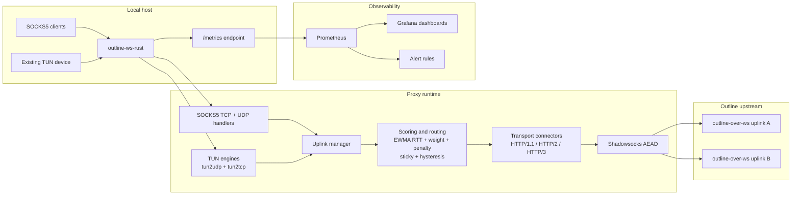

# outline-ws-rust

`outline-ws-rust` is a production-oriented Rust proxy that accepts local SOCKS5 traffic and forwards it to Outline-compatible WebSocket transports over HTTP/1.1, HTTP/2, or HTTP/3.

It supports:

- SOCKS5 `CONNECT`
- SOCKS5 `UDP ASSOCIATE`
- multi-uplink failover and load balancing
- WebSocket-over-HTTP/1.1, RFC 8441 (`ws-over-h2`), and RFC 9220 (`ws-over-h3`)
- Prometheus metrics and packaged Grafana dashboards
- existing TUN device integration for `tun2udp`
- stateful `tun2tcp` relay with production-oriented guardrails

## Overview

At a high level, the process does five jobs:

1. Accepts local SOCKS5 and optional TUN traffic.
2. Selects the best available uplink using health probes, EWMA RTT scoring, sticky routing, hysteresis, penalties, and warm standby.
3. Connects to an Outline WebSocket transport using the requested mode (`http1`, `h2`, or `h3`) with automatic fallback.
4. Encrypts payloads using Shadowsocks AEAD before sending them upstream.
5. Exposes Prometheus metrics for runtime, uplink, probe, TUN, and `tun2tcp` behavior.

## Architecture



## Supported Features

### SOCKS5

- No-auth SOCKS5
- TCP `CONNECT`
- UDP `ASSOCIATE`
- SOCKS5 UDP fragmentation reassembly on inbound client traffic
- IPv4, IPv6, and domain-name targets

### Outline transports

- `ws://` and `wss://`
- HTTP/1.1 Upgrade
- RFC 8441 WebSocket over HTTP/2
- RFC 9220 WebSocket over HTTP/3 / QUIC
- transport fallback:
  - `h3 -> h2 -> http1`
  - `h2 -> http1`

### Encryption

- `chacha20-ietf-poly1305`
- `aes-128-gcm`
- `aes-256-gcm`

### Uplink management

- multiple uplinks
- fastest-first selection
- selection mode:
  - `active_active`: new flows can use different uplinks based on score, stickiness, and failover
  - `active_passive`: keep the current selected uplink until it becomes unhealthy or enters cooldown
- routing scope:
  - `per_flow`: decisions are made independently per routing key / target
  - `per_uplink`: one active uplink is shared process-wide per transport (`tcp` and `udp`); in `active_passive` mode the pinned TCP and UDP uplinks do not expire with `sticky_ttl`, transport-specific flows are closed if they remain attached to an older active uplink after reselection, and penalty history is not folded into the strict per-transport score
  - `global`: one shared process-wide active uplink is used for new user traffic across both `tcp` and `udp`; selection is intentionally biased toward TCP health and TCP score so UDP quality has only weak influence on which uplink becomes globally active, the active global uplink does not expire with `sticky_ttl`, strict active selection now stays pinned until the current global uplink enters cooldown, penalty history is not folded into the strict global score, and TUN flows that remain pinned to an older uplink after a global switch are actively closed so they reconnect through the new global uplink
- per-uplink static `weight`
- RTT EWMA scoring
- failure penalty model with decay
- sticky routing with TTL
- hysteresis to avoid unnecessary churn
- runtime failover
- warm-standby WebSocket pools for TCP and UDP

### Health probing

- WebSocket ping/pong probes
- real HTTP probes over `websocket-stream`
- real DNS probes over `websocket-packet`
- probe concurrency limits
- separate probe dial isolation

### TUN

- existing TUN device integration only
- `tun2udp` with flow lifecycle management and local ICMP echo replies
- stateful `tun2tcp` relay with retransmit, zero-window persist/backoff, SACK-aware receive/send behavior, adaptive RTO, and bounded buffering

### Operations

- Prometheus metrics
- packaged Grafana dashboards
- packaged Prometheus alert rules
- hardened systemd unit
- Linux `fwmark` / `SO_MARK`
- IPv6-capable listeners, upstreams, probes, and SOCKS5 targets

## Current Limits

The project is intentionally practical, but there are still boundaries:

- SOCKS5 username/password auth is not implemented.
- Shadowsocks 2022 is not implemented.
- `tun2tcp` is production-oriented but still not a kernel-equivalent TCP stack.
- IPv4 fragments, IPv6 extension-header paths, and non-echo ICMP traffic on TUN are not supported.
- HTTP probe supports `http://` today, not `https://`.
- TCP failover is safe before useful payload exchange; live established TCP tunnels cannot be migrated transparently between uplinks.

## Repository Layout

- [`config.toml`](/Users/mmalykhin/Documents/Playground/config.toml) - example configuration
- [`systemd/outline-ws-rust.service`](/Users/mmalykhin/Documents/Playground/systemd/outline-ws-rust.service) - hardened systemd unit
- [`grafana/outline-ws-rust-dashboard.json`](/Users/mmalykhin/Documents/Playground/grafana/outline-ws-rust-dashboard.json) - main operational dashboard
- [`grafana/outline-ws-rust-tun-tcp-dashboard.json`](/Users/mmalykhin/Documents/Playground/grafana/outline-ws-rust-tun-tcp-dashboard.json) - `tun2tcp` dashboard
- [`prometheus/outline-ws-rust-alerts.yml`](/Users/mmalykhin/Documents/Playground/prometheus/outline-ws-rust-alerts.yml) - Prometheus alert rules
- [`PATCHES.md`](/Users/mmalykhin/Documents/Playground/PATCHES.md) - local vendored patch inventory

## Build

Standard build:

```bash
cargo build --release
```

Allocator selection:

- default: `allocator-jemalloc`
- optional: `allocator-system`

Examples:

```bash
# Default production build (jemalloc)
cargo build --release

# Explicit jemalloc build
cargo build --release --no-default-features --features allocator-jemalloc

# System allocator build
cargo build --release --no-default-features --features allocator-system
```

Example static-ish Linux build with musl:

```bash
cargo zigbuild --release --target x86_64-unknown-linux-musl
```

## Quick Start

Minimal local run using `config.toml`:

```bash
cargo run --release
```

Example one-shot CLI override:

```bash
cargo run --release -- \
  --listen [::]:1080 \
  --tcp-ws-url wss://example.com/SECRET/tcp \
  --tcp-ws-mode h3 \
  --udp-ws-url wss://example.com/SECRET/udp \
  --udp-ws-mode h3 \
  --method chacha20-ietf-poly1305 \
  --password 'Secret0'
```

Example client settings:

- SOCKS5 host: `::1` or `127.0.0.1`
- SOCKS5 port: `1080`

For `listen = "[::]:1080"`, many systems create a dual-stack listener. If your platform does not map IPv4 to IPv6 sockets, bind an additional IPv4 listener instead.

## Configuration

By default the process reads [`config.toml`](/Users/mmalykhin/Documents/Playground/config.toml).

Example:

```toml
[socks5]
listen = "[::]:1080"

[metrics]
listen = "[::1]:9090"

[tun]
# Existing TUN device path. Creation, IP addresses and routes stay outside the app.
# Linux example:
# path = "/dev/net/tun"
# name = "tun0"
# macOS / BSD example:
# path = "/dev/tun0"
# mtu = 1500
# max_flows = 4096
# idle_timeout_secs = 300

# [tun.tcp]
# connect_timeout_secs = 10
# handshake_timeout_secs = 15
# half_close_timeout_secs = 60
# max_pending_server_bytes = 1048576
# max_buffered_client_segments = 4096
# max_buffered_client_bytes = 262144
# max_retransmits = 12

[probe]
interval_secs = 30
timeout_secs = 10
max_concurrent = 4
max_dials = 2
min_failures = 1

[probe.ws]
enabled = true

[probe.http]
url = "http://example.com/"

[probe.dns]
server = "1.1.1.1"
port = 53
name = "example.com"

[load_balancing]
mode = "active_active"
routing_scope = "per_flow"
warm_standby_tcp = 1
warm_standby_udp = 1
sticky_ttl_secs = 300
hysteresis_ms = 50
failure_cooldown_secs = 10
rtt_ewma_alpha = 0.3
failure_penalty_ms = 500
failure_penalty_max_ms = 30000
failure_penalty_halflife_secs = 60
h3_downgrade_secs = 60

[[uplinks]]
name = "primary"
tcp_ws_url = "wss://example.com/SECRET/tcp"
weight = 1.0
tcp_ws_mode = "h3"
# fwmark = 100
udp_ws_url = "wss://example.com/SECRET/udp"
udp_ws_mode = "h3"
method = "chacha20-ietf-poly1305"
password = "Secret0"

[[uplinks]]
name = "backup"
tcp_ws_url = "wss://backup.example.com/SECRET/tcp"
weight = 0.8
tcp_ws_mode = "h2"
udp_ws_url = "wss://backup.example.com/SECRET/udp"
udp_ws_mode = "h2"
method = "chacha20-ietf-poly1305"
password = "Secret0"
```

### Key config behavior

- `tcp_ws_mode` / `udp_ws_mode` accept `http1`, `h2`, or `h3`.
- `[probe] min_failures` (default `1`): consecutive probe failures required before an uplink is declared unhealthy. Increase to `2` or `3` to tolerate intermittent probe blips without triggering a full failover.
- `[load_balancing] h3_downgrade_secs` (default `60`): how long an uplink that experienced an H3 application-level error (e.g. `H3_INTERNAL_ERROR`) stays in H2 fallback mode before H3 is retried. Set to `0` to disable automatic H3 downgrade.
- The canonical config format is `probe`, `load_balancing`, and `uplinks` without the `outline.` prefix.
- The legacy `[outline]` format is still accepted for backward compatibility, and remains the least confusing way to express a single-uplink shorthand TOML config.
- CLI flags and environment variables can override file settings.
- `--metrics-listen` can enable metrics even if `[metrics]` is not present.
- `--tun-path` can enable TUN even if `[tun]` is not present.
- `memory_trim_interval_secs` defaults to `60`. With the default jemalloc build it keeps allocator background maintenance active by enabling `background_thread` when needed and advancing `epoch` so allocator stats stay fresh. With the system allocator on Linux/glibc it keeps periodic `malloc_trim(0)` enabled to return free pages to the OS after traffic spikes. Set it to `0` to disable periodic trimming.

### Useful CLI and env overrides

- `--config` / `PROXY_CONFIG`
- `--listen` / `SOCKS5_LISTEN`
- `--tcp-ws-url` / `OUTLINE_TCP_WS_URL`
- `--tcp-ws-mode` / `OUTLINE_TCP_WS_MODE`
- `--udp-ws-url` / `OUTLINE_UDP_WS_URL`
- `--udp-ws-mode` / `OUTLINE_UDP_WS_MODE`
- `--method` / `SHADOWSOCKS_METHOD`
- `--password` / `SHADOWSOCKS_PASSWORD`
- `--metrics-listen` / `METRICS_LISTEN`
- `--memory-trim-interval-secs` / `MEMORY_TRIM_INTERVAL_SECS`
- `--tun-path` / `TUN_PATH`
- `--tun-name` / `TUN_NAME`
- `--tun-mtu` / `TUN_MTU`
- `--fwmark` / `OUTLINE_FWMARK`

## Transport Modes

### HTTP/1.1

Use when you want the most compatible baseline behavior.

### HTTP/2

Use when the upstream supports RFC 8441 Extended CONNECT for WebSockets.

### HTTP/3

Use when the upstream supports RFC 9220 and QUIC/UDP is available end to end.

Recommended operator stance:

- prefer `http1` as a conservative baseline
- enable `h2` only when the reverse proxy and origin are known-good for RFC 8441
- enable `h3` only when QUIC is explicitly supported and reachable

**Shared QUIC endpoint:** H3 connections that do not use a per-uplink `fwmark` share a single UDP socket per address family (one for IPv4, one for IPv6). This means N warm-standby H3 connections do not open N UDP sockets. Connections that require a specific `fwmark` still use their own dedicated socket because the mark must be applied before the first `sendmsg`.

QUIC keep-alive pings are sent every 10 seconds to prevent NAT mapping expiry and to allow the server to detect dead connections without waiting for the full idle timeout.

Runtime fallback behavior:

- requested `h3` tries `h3`, then `h2`, then `http1`
- requested `h2` tries `h2`, then `http1`

**H3 runtime downgrade:** when an active H3 TCP connection is closed by the server with an application-level H3 error code (e.g. `H3_INTERNAL_ERROR`, `H3_REQUEST_REJECTED`, `H3_CONNECT_ERROR`), the uplink automatically falls back to H2 for new TCP connections for the duration configured by `h3_downgrade_secs` (default: 60 seconds). After the downgrade window expires, H3 is retried. This prevents reconnect storms where every new flow establishes an H3 connection only to have the server close the entire QUIC connection shortly after.

Warm-standby connections respect the active downgrade state: while an uplink is in H3→H2 downgrade, new standby slots are filled using H2.

## Uplink Selection and Runtime Behavior

Each uplink has its own:

- TCP URL and mode
- UDP URL and mode
- cipher and password
- optional Linux `fwmark`
- optional relative routing preference via `weight`

Selection pipeline:

1. Health probes update the latest raw RTT and EWMA RTT.
2. Runtime and probe failures add a decaying failure penalty.
3. Effective latency is derived from EWMA RTT plus current penalty.
4. Final score is `effective_latency / weight`.
5. Sticky routing and hysteresis reduce avoidable switches.
6. Warm-standby pools reduce connection setup latency.

Routing scope behavior:

- `per_flow`: different targets can choose different uplinks
- `per_uplink`: one selected uplink is shared per transport, so TCP and UDP may still use different uplinks; in `active_passive` mode each transport keeps its own pinned active uplink until failover or explicit reselection, and penalties no longer bias the strict transport score
- `global`: one selected uplink is shared across all new user traffic until failover or explicit reselection, with TCP health and TCP score taking priority over UDP quality; in this mode strict selection stays pinned to the current active uplink until it enters cooldown, penalties no longer bias the strict global score, and UDP traffic no longer falls through to a backup uplink while the current global uplink is still the active TCP choice

**Penalty-aware failover:** when the current active uplink enters cooldown and the selector must pick a replacement, candidates are re-sorted with penalty-aware scoring (EWMA RTT + decaying failure penalty / weight). This prevents oscillation with three or more uplinks: without penalties, a probe-cleared primary with a better raw EWMA would be selected again immediately even though it just failed, causing rapid back-and-forth. With penalties, a fresher backup with a higher raw RTT wins over the recently-failed primary until the penalty decays.

Runtime failover:

- UDP can switch uplinks within an active association after runtime send/read failure.
- TCP can fail over before a usable tunnel is established.
- Established TCP tunnels are not live-migrated.

## Health Probes

Available probe types:

- `ws`: transport-level ping/pong validation
- `http`: real HTTP request over `websocket-stream`
- `dns`: real DNS exchange over `websocket-packet`

Probe execution controls:

- `max_concurrent`: total concurrent probe tasks
- `max_dials`: dedicated cap for probe dial attempts
- `min_failures`: minimum number of consecutive probe failures required before the uplink is marked unhealthy and a runtime failure is recorded (default: `1`)

Probe activation rules:

- probes do not start unless probe settings are explicitly configured
- `[probe]` alone does not enable any check
- at least one of `[probe.ws]`, `[probe.http]`, or `[probe.dns]` must be present

## IPv6

Supported:

- SOCKS5 IPv6 targets
- IPv6 literal upstream URLs such as `wss://[2001:db8::10]/SECRET/tcp`
- IPv6 probes
- IPv6 listeners
- IPv6 UDP packets in TUN mode
- IPv6 upstream transport for `h2` and `h3`

## TUN Mode

The process attaches only to an already existing TUN device. Interface creation, addresses, routing, and policy routing stay outside the app.

### tun2udp

Capabilities:

- IPv4 and IPv6 UDP packet forwarding
- local IPv4 ICMP echo reply (`ping`) handling
- local IPv6 ICMPv6 echo reply handling
- per-flow uplink transport
- flow idle cleanup
- bounded flow count
- oldest-flow eviction on overflow
- flow metrics and packet outcome metrics, including local ICMP replies

### tun2tcp

Capabilities:

- stateful userspace TCP relay over Outline TCP uplinks
- SYN / SYN-ACK / FIN / RST handling
- out-of-order buffering
- receive-window enforcement
- SACK-aware receive/send logic
- adaptive RTO
- zero-window persist/backoff
- bounded buffering and retransmit budgets
- flow termination on timeout, overflow, or relay failure
- transport-error reporting to the uplink penalty system: abrupt upstream closes (e.g. QUIC `APPLICATION_CLOSE` / `H3_INTERNAL_ERROR`) are forwarded to `report_runtime_failure`, so the H3→H2 downgrade and failure penalty apply to TUN TCP flows the same way they apply to SOCKS5 flows; clean WebSocket closes (FIN or Close frame) are not counted as failures

This is intended for real operations, but it is still not equivalent to a kernel TCP stack.

## Linux fwmark

Per-uplink `fwmark` applies `SO_MARK` to outbound sockets:

- HTTP/1.1 WebSocket TCP sockets
- HTTP/2 WebSocket TCP sockets
- HTTP/3 QUIC UDP sockets
- probe dials
- warm-standby connections

Requirements:

- Linux only
- `CAP_NET_ADMIN`

## Metrics and Dashboards

If metrics are enabled, the process serves:

- `/metrics` - Prometheus text exposition

Example:

```bash
curl http://[::1]:9090/metrics
```

Prometheus example:

```yaml
scrape_configs:
  - job_name: outline-ws-rust
    metrics_path: /metrics
    static_configs:
      - targets:
          - "[::1]:9090"
```

Metrics include:

- build and startup info
- process resident memory and heap usage gauges
- SOCKS5 requests and active sessions
- session duration histogram
- rolling session p95 gauge
- payload bytes and UDP datagrams
- uplink health, latency, EWMA RTT, penalties, score, cooldown, standby readiness
- per-uplink consecutive TCP/UDP failure counters
- per-uplink H3 downgrade state (remaining downgrade window in milliseconds)
- probe results and latency
- warm-standby acquire and refill outcomes
- TUN flow and packet metrics
- `tun2tcp` retransmit, backlog, window, RTT, and RTO metrics

On Linux, the process memory sampler updates:

- `outline_ws_rust_process_resident_memory_bytes`
- `outline_ws_rust_process_virtual_memory_bytes`
- `outline_ws_rust_process_heap_memory_bytes`
- `outline_ws_rust_process_heap_allocated_bytes`
- `outline_ws_rust_process_heap_free_bytes`
- `outline_ws_rust_process_heap_mode_info{mode}`
- `outline_ws_rust_process_open_fds`
- `outline_ws_rust_process_malloc_trim_total{reason,result}`
- `outline_ws_rust_process_malloc_trim_errors_total{reason}`
- `outline_ws_rust_process_malloc_trim_last_released_bytes{kind="rss|heap"}`
- `outline_ws_rust_process_malloc_trim_last_bytes{kind="rss|heap",stage="before|after|released"}`

With the default `jemalloc` build, heap metrics come from allocator stats:

- `heap_memory_bytes` reflects jemalloc active bytes
- `heap_allocated_bytes` reflects jemalloc allocated bytes
- `heap_free_bytes` reflects `active - allocated`
- `heap_mode_info{mode="jemalloc"}` marks that allocator-aware sampling is active

With the default jemalloc build, periodic and opportunistic trim maintenance enables `background_thread` when needed and advances `epoch`; it does not try to write to `arena.<n>.purge`.

On Linux with glibc and the system allocator, opportunistic allocator trimming also emits a dedicated log entry:

- `malloc_trim invoked`

On Linux, the process also emits a periodic descriptor inventory log:

- `process fd snapshot`

When allocator trimming is supported, the log includes RSS and heap before and after trimming so you can verify whether memory is actually being returned on your host.
The descriptor snapshot includes total open FDs plus a breakdown for sockets, pipes, anon inodes, regular files, and other descriptor types.
The main dashboard now has a dedicated `Memory & Allocator` section with `Current RSS`, `Last RSS Released`, `Trim Errors`, `Allocator Heap Mode`, `Process Memory`, `Allocator Heap State`, `Allocator Trim Activity`, and `Allocator Trim Effect`. Descriptor and transport pressure remain in a separate section so allocator behavior is visible without mixing it with FD churn.

When runtime failure storms are suppressed because an uplink is already in cooldown, `outline_ws_rust_uplink_runtime_failures_suppressed_total{transport,uplink}` and the `Suppressed Runtime Failures` panel show how much duplicate failure churn was intentionally ignored.
`outline_ws_rust_selection_mode_info{mode}`, `outline_ws_rust_routing_scope_info{scope}`, `outline_ws_rust_global_active_uplink_info{uplink}`, and `outline_ws_rust_sticky_routes_total` feed the `Selection Mode`, `Routing Scope`, `Global Active Uplink`, and `Global Sticky Routes` stat panels so you can confirm how the selector is configured and, in `global` scope, whether a sticky active uplink is currently pinned.
When TUN UDP forwarding fails before a packet can be delivered upstream, `outline_ws_rust_tun_udp_forward_errors_total{reason}` and the `UDP Forward Errors` panel break that down into `all_uplinks_failed`, `transport_error`, `connect_failed`, and `other`.
Local ICMP echo handling is exported separately via `outline_ws_rust_tun_icmp_local_replies_total{ip_family}` and visualized in the `Local ICMP Replies` panel.
The `Active UDP Flows` panel shows current TUN UDP flow count alongside configured capacity, `UDP Flow Pressure Ratio` is a quick stat+spline indicator of how close the current UDP flow table is to its limit, and `UDP Flow Lifecycle` shows whether active flow growth comes from normal creation outpacing closure (`created > closed`) or from cleanup not keeping up with the current traffic mix.

Dashboards:

- [`grafana/outline-ws-rust-dashboard.json`](/Users/mmalykhin/Documents/Playground/grafana/outline-ws-rust-dashboard.json)
- [`grafana/outline-ws-rust-tun-tcp-dashboard.json`](/Users/mmalykhin/Documents/Playground/grafana/outline-ws-rust-tun-tcp-dashboard.json)

The main dashboard is grouped into:

- Overview
- Routing Policy
- Traffic
- Latency
- Health & Routing
- Memory & Allocator
- FD & Transport Pressure
- Probes & Standby
- TUN

Traffic panels on the main dashboard now break payload throughput down by `uplink`, so active traffic split between `nuxt` and `senko` is visible directly in `Payload by Uplink (Selected Range)` and `Protocol Throughput`.

The `tun2tcp` dashboard is grouped into:

- Overview
- Recovery & Loss
- Backlog & Flow State
- Timing & Window Control

Both dashboards use a shared color language: blue for traffic and baseline timing, amber for pressure or degraded latency, red for failures and loss, and green for healthy capacity or successful standby behavior.
Legends also use a shared ordering convention: `instance`, then `uplink` when present, then the metric or event name. The `instance` label is shortened to the part before the first dot to keep legends compact.
`outline_ws_rust_allocator_info{allocator=...}` exports the selected allocator explicitly, and the main dashboard shows it in the `Allocator` panel so you can confirm whether an instance is running with `jemalloc` or the system allocator.

Alert rules:

- [`prometheus/outline-ws-rust-alerts.yml`](/Users/mmalykhin/Documents/Playground/prometheus/outline-ws-rust-alerts.yml)

## Systemd Deployment

The repository includes a hardened unit:

- [`systemd/outline-ws-rust.service`](/Users/mmalykhin/Documents/Playground/systemd/outline-ws-rust.service)

Key operational notes:

- `PrivateDevices=false` is required for host TUN access.
- Keep `AmbientCapabilities=CAP_NET_ADMIN` and `CapabilityBoundingSet=CAP_NET_ADMIN` when using `fwmark`.
- `RUST_LOG=info` is already set in the unit.

Typical deployment layout:

- binary: `/usr/local/bin/outline-ws-rust`
- config: `/etc/outline-ws-rust/config.toml`
- working state: `/var/lib/outline-ws-rust`

## Testing

Useful local checks:

```bash
cargo check
cargo test
```

Manual real-upstream integration tests exist for HTTP/2 and HTTP/3:

```bash
RUN_REAL_SERVER_H2=1 \
OUTLINE_TCP_WS_URL='wss://example.com/SECRET/tcp' \
OUTLINE_UDP_WS_URL='wss://example.com/SECRET/udp' \
SHADOWSOCKS_PASSWORD='Secret0' \
cargo test --test real_server_h2 -- --nocapture
```

```bash
RUN_REAL_SERVER_H3=1 \
OUTLINE_TCP_WS_URL='wss://example.com/SECRET/tcp' \
OUTLINE_UDP_WS_URL='wss://example.com/SECRET/udp' \
SHADOWSOCKS_PASSWORD='Secret0' \
cargo test --test real_server_h3 -- --nocapture
```

There is also a dedicated warm-standby integration test:

```bash
cargo test --test standby_validation -- --nocapture
```

## Protocol References

- [Outline `outline-ss-server`](https://github.com/Jigsaw-Code/outline-ss-server)
- [Shadowsocks AEAD specification](https://shadowsocks.org/doc/aead.html)
- [RFC 8441: Bootstrapping WebSockets with HTTP/2](https://datatracker.ietf.org/doc/html/rfc8441)
- [RFC 9220: Bootstrapping WebSockets with HTTP/3](https://datatracker.ietf.org/doc/html/rfc9220)

## Local Patch Tracking

Vendored dependency patches are tracked in:

- [`PATCHES.md`](/Users/mmalykhin/Documents/Playground/PATCHES.md)

This is the source of truth for local deviations from upstream crates, including the vendored `h3` patch used for RFC 9220 support.
