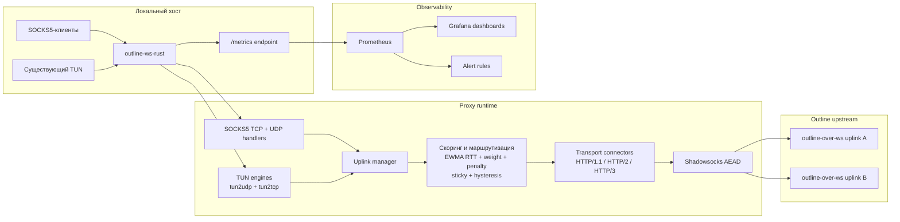

# outline-ws-rust

`outline-ws-rust` — production-ориентированный Rust-прокси, который принимает локальный SOCKS5-трафик и перенаправляет его на Outline-совместимые WebSocket-транспорты по HTTP/1.1, HTTP/2 или HTTP/3.

Поддерживает:

- SOCKS5 `CONNECT`
- SOCKS5 `UDP ASSOCIATE`
- failover и балансировку нагрузки между несколькими аплинками
- WebSocket-over-HTTP/1.1, RFC 8441 (`ws-over-h2`) и RFC 9220 (`ws-over-h3`)
- метрики Prometheus и готовые дашборды Grafana
- интеграцию с существующим TUN-устройством для `tun2udp`
- stateful `tun2tcp`-реле с production-ориентированными ограничениями

---

*English version: [README.md](README.md)*

## Обзор

На верхнем уровне процесс выполняет пять задач:

1. Принимает локальный SOCKS5 и опциональный TUN-трафик.
2. Выбирает лучший доступный аплинк с помощью health-проб, EWMA RTT-скоринга, sticky-маршрутизации, гистерезиса, штрафов и warm standby.
3. Подключается к Outline WebSocket-транспорту в запрошенном режиме (`http1`, `h2` или `h3`) с автоматическим fallback.
4. Шифрует payload с помощью Shadowsocks AEAD перед отправкой в upstream.
5. Публикует метрики Prometheus для runtime, аплинков, проб, TUN и `tun2tcp`.

## Архитектура



## Поддерживаемые возможности

### SOCKS5

- SOCKS5 без аутентификации
- TCP `CONNECT`
- UDP `ASSOCIATE`
- пересборка UDP-фрагментов SOCKS5 на входящем клиентском трафике
- цели IPv4, IPv6 и по доменному имени

### Outline-транспорты

- `ws://` и `wss://`
- HTTP/1.1 Upgrade
- RFC 8441 WebSocket over HTTP/2
- RFC 9220 WebSocket over HTTP/3 / QUIC
- transport fallback:
  - `h3 -> h2 -> http1`
  - `h2 -> http1`

### Шифрование

- `chacha20-ietf-poly1305`
- `aes-128-gcm`
- `aes-256-gcm`

### Управление аплинками

- несколько аплинков
- выбор по принципу «быстрейший первый»
- режим выбора:
  - `active_active`: новые потоки могут использовать разные аплинки в зависимости от скора, sticky и failover
  - `active_passive`: удерживать текущий выбранный аплинк, пока он не станет нездоровым или не войдёт в cooldown
- область маршрутизации:
  - `per_flow`: решения принимаются независимо для каждого ключа маршрутизации / цели
  - `per_uplink`: один активный аплинк разделяется на уровне процесса для каждого транспорта (`tcp` и `udp`); в режиме `active_passive` закреплённые TCP и UDP аплинки не истекают по `sticky_ttl`, транспортные потоки закрываются при переключении на новый активный, история штрафов не влияет на строгий per-transport скор
  - `global`: один общий активный аплинк используется для всего нового трафика процесса через `tcp` и `udp`; выбор намеренно смещён в сторону TCP-здоровья, активный глобальный аплинк не истекает по `sticky_ttl`, строгий выбор остаётся закреплённым пока текущий не уйдёт в cooldown, история штрафов не влияет на строгий глобальный скор, TUN-потоки, закреплённые за старым аплинком, активно закрываются после глобального переключения
- статический `weight` на аплинк
- EWMA RTT-скоринг
- модель штрафов за сбои с затуханием
- sticky-маршрутизация с TTL
- гистерезис для исключения лишних переключений
- runtime failover
- auto-failback отключён по умолчанию (`auto_failback = false`): переключение только при сбое, никогда не возвращается на восстановившийся primary самостоятельно
- warm-standby WebSocket-пулы для TCP и UDP

### Health-пробы

- WebSocket connectivity-пробы (handshake TCP+TLS+WS; без ping/pong — серверы редко отвечают на WebSocket ping control frames)
- реальные HTTP-пробы через `websocket-stream`
- реальные DNS-пробы через `websocket-packet`
- ограничение параллельности проб
- отдельная изоляция dial'ов для проб
- немедленное пробуждение probe loop при runtime-сбое для ускорения обнаружения
- счётчик последовательных успехов для стабильного auto-failback

### TUN

- только интеграция с существующим TUN-устройством
- `tun2udp` с управлением жизненным циклом потоков и локальными ICMP echo replies
- stateful `tun2tcp`-реле с ретрансмитом, zero-window persist/backoff, SACK-aware логикой приёма/отправки, adaptive RTO и bounded buffering

### Операционная поддержка

- метрики Prometheus
- готовые дашборды Grafana
- готовые alert rules Prometheus
- hardened systemd unit
- Linux `fwmark` / `SO_MARK`
- IPv6-совместимые слушатели, upstream'ы, пробы и SOCKS5-цели

## Текущие ограничения

Проект намеренно практичен, но ограничения есть:

- Аутентификация SOCKS5 по логину/паролю не реализована.
- Shadowsocks 2022 не реализован.
- `tun2tcp` ориентирован на production, но всё ещё не эквивалентен ядерному TCP-стеку.
- IPv4-фрагменты, пути с extension headers в IPv6 и не-echo ICMP на TUN не поддерживаются.
- HTTP-проба поддерживает только `http://`, не `https://`.
- TCP failover безопасен до начала полезного обмена данными; живые установленные TCP-туннели не мигрируют прозрачно между аплинками.

## Структура репозитория

- `config.toml` — пример конфигурации
- `systemd/outline-ws-rust.service` — hardened systemd unit
- `grafana/outline-ws-rust-dashboard.json` — основной операционный дашборд
- `grafana/outline-ws-rust-tun-tcp-dashboard.json` — дашборд `tun2tcp`
- `prometheus/outline-ws-rust-alerts.yml` — alert rules Prometheus
- `PATCHES.md` — реестр локальных патчей vendored-зависимостей

## Сборка

Стандартная сборка:

```bash
cargo build --release
```

Выбор аллокатора:

- по умолчанию: `allocator-jemalloc`
- опционально: `allocator-system`

Примеры:

```bash
# Стандартная production-сборка (jemalloc)
cargo build --release

# Явная сборка с jemalloc
cargo build --release --no-default-features --features allocator-jemalloc

# Сборка с системным аллокатором
cargo build --release --no-default-features --features allocator-system
```

Пример статической сборки под Linux с musl:

```bash
cargo zigbuild --release --target x86_64-unknown-linux-musl
```

## Быстрый старт

Минимальный локальный запуск через `config.toml`:

```bash
cargo run --release
```

Пример запуска с переопределением параметров через CLI:

```bash
cargo run --release -- \
  --listen [::]:1080 \
  --tcp-ws-url wss://example.com/SECRET/tcp \
  --tcp-ws-mode h3 \
  --udp-ws-url wss://example.com/SECRET/udp \
  --udp-ws-mode h3 \
  --method chacha20-ietf-poly1305 \
  --password 'Secret0'
```

Пример настроек клиента:

- SOCKS5 host: `::1` или `127.0.0.1`
- SOCKS5 port: `1080`

При `listen = "[::]:1080"` большинство систем создают dual-stack слушатель. Если ваша платформа не проксирует IPv4 через IPv6 сокеты, добавьте отдельный IPv4-слушатель.

## Конфигурация

По умолчанию процесс читает `config.toml`.

Пример:

```toml
[socks5]
listen = "[::]:1080"

[metrics]
listen = "[::1]:9090"

[tun]
# Путь к существующему TUN-устройству. Создание, IP-адреса и маршруты — вне приложения.
# Linux:
# path = "/dev/net/tun"
# name = "tun0"
# macOS / BSD:
# path = "/dev/tun0"
# mtu = 1500
# max_flows = 4096
# idle_timeout_secs = 300

# [tun.tcp]
# connect_timeout_secs = 10
# handshake_timeout_secs = 15
# half_close_timeout_secs = 60
# max_pending_server_bytes = 1048576
# max_buffered_client_segments = 4096
# max_buffered_client_bytes = 262144
# max_retransmits = 12

[probe]
interval_secs = 30
timeout_secs = 10
max_concurrent = 4
max_dials = 2
min_failures = 1

[probe.ws]
enabled = true

[probe.http]
url = "http://example.com/"

[probe.dns]
server = "1.1.1.1"
port = 53
name = "example.com"

[load_balancing]
mode = "active_active"
routing_scope = "per_flow"
warm_standby_tcp = 1
warm_standby_udp = 1
sticky_ttl_secs = 300
hysteresis_ms = 50
failure_cooldown_secs = 10
rtt_ewma_alpha = 0.3
failure_penalty_ms = 500
failure_penalty_max_ms = 30000
failure_penalty_halflife_secs = 60
h3_downgrade_secs = 60
# auto_failback = false   # по умолчанию: переключение только при сбое, без автовозврата на primary

[[uplinks]]
name = "primary"
tcp_ws_url = "wss://example.com/SECRET/tcp"
weight = 1.0
tcp_ws_mode = "h3"
# fwmark = 100
udp_ws_url = "wss://example.com/SECRET/udp"
udp_ws_mode = "h3"
method = "chacha20-ietf-poly1305"
password = "Secret0"

[[uplinks]]
name = "backup"
tcp_ws_url = "wss://backup.example.com/SECRET/tcp"
weight = 0.8
tcp_ws_mode = "h2"
udp_ws_url = "wss://backup.example.com/SECRET/udp"
udp_ws_mode = "h2"
method = "chacha20-ietf-poly1305"
password = "Secret0"
```

### Ключевые параметры конфигурации

- `tcp_ws_mode` / `udp_ws_mode` принимают значения `http1`, `h2` или `h3`.
- `[probe] min_failures` (по умолчанию `1`): количество последовательных неудачных проб, необходимых для объявления аплинка нездоровым. Увеличьте до `2` или `3`, чтобы допускать разовые сбои проб без запуска failover. То же значение используется в качестве порога стабильности последовательных успехов для `auto_failback`.
- `[load_balancing] auto_failback` (по умолчанию `false`): управляет тем, возвращает ли прокси трафик на восстановившийся аплинк с более высоким приоритетом.
  - `false` (по умолчанию): активный аплинк заменяется **только при сбое**. Как только прокси переключился на резервный, он остаётся на нём, пока не упадёт сам резервный — никакого автоматического возврата на primary. Рекомендуется для production, чтобы исключить лишние обрывы соединений.
  - `true`: если текущий активный аплинк здоров, но существует кандидат с **более высоким `weight`** (или равным weight и меньшим индексом в конфиге), прокси может вернуть трафик на него — но только после того, как кандидат накопит `min_failures` последовательных успешных циклов проб. Приоритет определяется `weight`, а не EWMA RTT: это исключает ложные переключения под нагрузкой, когда EWMA активного аплинка временно растёт из-за медленных соединений, а idle-резервный выглядит лучше по latency. Failback всегда движется в сторону большего `weight` (`1.0 → 1.5 → 2.0`): переключение на аплинк с меньшим weight через auto_failback невозможно — это failover, который требует probe-подтверждённого сбоя.
- `[load_balancing] h3_downgrade_secs` (по умолчанию `60`): сколько секунд аплинк, получивший H3-ошибку на уровне приложения (например, `H3_INTERNAL_ERROR`), будет использовать H2-fallback перед повторной попыткой H3. Установите `0`, чтобы отключить автоматический H3-даунгрейд.
- Канонический формат конфига использует секции `probe`, `load_balancing` и `uplinks` без префикса `outline.`.
- Устаревший формат `[outline]` по-прежнему поддерживается для обратной совместимости.
- Флаги CLI и переменные окружения переопределяют настройки из файла.
- `--metrics-listen` включает метрики даже без секции `[metrics]` в конфиге.
- `--tun-path` включает TUN даже без секции `[tun]` в конфиге.
- `memory_trim_interval_secs` по умолчанию `60`. При сборке с jemalloc поддерживает активность фонового обслуживания аллокатора. С системным аллокатором на Linux/glibc запускает периодический `malloc_trim(0)` для возврата свободных страниц ОС. Установите `0`, чтобы отключить.

### Полезные переопределения через CLI и переменные окружения

- `--config` / `PROXY_CONFIG`
- `--listen` / `SOCKS5_LISTEN`
- `--tcp-ws-url` / `OUTLINE_TCP_WS_URL`
- `--tcp-ws-mode` / `OUTLINE_TCP_WS_MODE`
- `--udp-ws-url` / `OUTLINE_UDP_WS_URL`
- `--udp-ws-mode` / `OUTLINE_UDP_WS_MODE`
- `--method` / `SHADOWSOCKS_METHOD`
- `--password` / `SHADOWSOCKS_PASSWORD`
- `--metrics-listen` / `METRICS_LISTEN`
- `--memory-trim-interval-secs` / `MEMORY_TRIM_INTERVAL_SECS`
- `--tun-path` / `TUN_PATH`
- `--tun-name` / `TUN_NAME`
- `--tun-mtu` / `TUN_MTU`
- `--fwmark` / `OUTLINE_FWMARK`

## Транспортные режимы

### HTTP/1.1

Используйте, когда нужна максимально совместимая базовая конфигурация.

### HTTP/2

Используйте, когда upstream поддерживает RFC 8441 Extended CONNECT для WebSocket.

### HTTP/3

Используйте, когда upstream поддерживает RFC 9220 и QUIC/UDP доступен end-to-end.

Рекомендуемый подход:

- предпочитайте `http1` как консервативную базу
- включайте `h2` только если reverse proxy и origin проверены на совместимость с RFC 8441
- включайте `h3` только если QUIC явно поддерживается и доступен

**Общий QUIC-эндпоинт:** H3-соединения без per-uplink `fwmark` разделяют один UDP-сокет на address family (один для IPv4, один для IPv6). Это означает, что N warm-standby H3-соединений не открывают N UDP-сокетов. Соединения с `fwmark` по-прежнему используют выделенный сокет, поскольку метка должна быть применена до первого `sendmsg`.

QUIC keep-alive пинги отправляются каждые 10 секунд для предотвращения истечения NAT-маппингов и обнаружения мёртвых соединений.

Runtime fallback:

- запрошенный `h3` пробует `h3`, затем `h2`, затем `http1`
- запрошенный `h2` пробует `h2`, затем `http1`

**H3 runtime downgrade:** при любом runtime-сбое TCP на аплинке с H3 (сброс соединения, ошибка стрима, QUIC transport error, `H3_INTERNAL_ERROR`, таймаут или любой другой upstream-сбой) аплинк автоматически переходит на H2 для новых TCP-соединений на время, заданное `h3_downgrade_secs` (по умолчанию 60 секунд). После истечения окна H3 повторно пробуется следующим реальным соединением. Это предотвращает reconnect-штормы, когда каждый новый поток устанавливает H3-соединение, которое вскоре падает.

Тот же даунгрейд также срабатывает при сбоях TCP-проб на H3-аплинках, предотвращая probe-driven flapping в режиме `active_passive + global`.

Поведение проб во время окна даунгрейда:
- Пробы используют `effective_tcp_ws_mode`, который возвращает H2, пока активен `h3_tcp_downgrade_until`. Таким образом, проба тестирует H2-связность в течение окна, а не продолжает стресс-тестирование сломанного H3.
- Успешная проба в окне **не** сбрасывает `h3_tcp_downgrade_until`. Восстановление H3 тестируется естественным образом после истечения таймера.

Скоринг во время окна даунгрейда (`per_flow` scope):
- Пока активен `h3_tcp_downgrade_until`, к эффективному latency-скору аплинка добавляется `failure_penalty_max` поверх обычного штрафа. Это предотвращает возврат `active_active + per_flow`-потоков на primary, пока тот работает в H2-режиме.

Warm-standby соединения учитывают активное состояние даунгрейда: пока аплинк в режиме H3→H2, новые standby-слоты заполняются через H2.

## Выбор аплинка и runtime-поведение

Каждый аплинк имеет собственные:

- TCP URL и режим
- UDP URL и режим
- шифр и пароль
- опциональный Linux `fwmark`
- опциональный относительный приоритет маршрутизации через `weight`

Пайплайн выбора:

1. Health-пробы обновляют последний raw RTT и EWMA RTT.
2. Probe-подтверждённые сбои добавляют затухающий штраф за сбой. При включённых пробах runtime-сбои (например, сброс H3-соединения под нагрузкой) сами по себе штраф не начисляют — только устанавливают временный cooldown. Штраф добавляется только когда проба подтверждает реальный отказ (`consecutive_failures ≥ min_failures`). Это предотвращает накопление штрафа на здоровом аплинке из-за транзитных ошибок под нагрузкой.
3. Эффективный latency = EWMA RTT + текущий штраф.
4. Итоговый скор = `effective_latency / weight`.
5. Sticky-маршрутизация и гистерезис снижают ненужные переключения.
6. Warm-standby пулы снижают задержку установки соединений.

Поведение в зависимости от области маршрутизации:

- `per_flow`: разные цели могут выбирать разные аплинки
- `per_uplink`: один выбранный аплинк разделяется на транспорт, TCP и UDP могут использовать разные; в режиме `active_passive` каждый транспорт держит свой закреплённый аплинк до failover, штрафы не влияют на строгий per-transport скор
- `global`: один выбранный аплинк разделяется для всего нового трафика до failover, TCP-здоровье и TCP-скор имеют приоритет над UDP; строгий выбор закреплён до cooldown активного, штрафы не влияют на строгий глобальный скор, UDP-трафик не проваливается на резервный пока текущий глобальный аплинк ещё активен по TCP

**Поведение auto-failback:** управляется параметром `load_balancing.auto_failback` (по умолчанию `false`).

- `false` (по умолчанию): активный аплинк **заменяется только при сбое** (уход в cooldown или потеря здоровья). Пока активный аплинк здоров, он остаётся активным вне зависимости от того, восстановился ли аплинк с более высоким приоритетом. Рекомендуется для production, поскольку исключает обрывы соединений из-за проактивного предпочтения primary.
- `true`: если текущий активный здоров и существует probe-healthy кандидат с более высоким `weight` (или равным weight и меньшим индексом), прокси возвращает трафик на него — но только после накопления `min_failures` последовательных успешных проб. Приоритет определяется `weight`, а не EWMA: это предотвращает ложные переключения под нагрузкой, когда EWMA активного аплинка временно выше из-за медленных соединений. Failback двигается только в сторону большего weight; переключение к аплинку с меньшим weight возможно только через probe-подтверждённый failover.

**Penalty-aware failover:** при уходе активного аплинка в cooldown кандидаты пересортируются с penalty-aware скорингом (EWMA RTT + затухающий штраф / weight). Это предотвращает осцилляцию при трёх и более аплинках: без штрафов очищенный пробой primary с лучшим raw EWMA сразу же выбрался бы снова, несмотря на только что случившийся сбой. Со штрафами свежий резервный с более высоким raw RTT побеждает недавно упавший primary, пока штраф не затухнет.

Runtime failover:

- UDP может переключать аплинки внутри активной ассоциации после runtime send/read сбоя.
- TCP может выполнять failover до установки рабочего туннеля.
- Живые установленные TCP-туннели не мигрируют.

## Health-пробы

Доступные типы проб:

- `ws`: проверяет TCP+TLS+WebSocket handshake-связность с аплинком. WebSocket ping/pong фреймы не отправляются — многие серверы не отвечают на WebSocket ping control frames. Подтверждает, что новое соединение может быть установлено; целостность data path проверяется HTTP/DNS-пробами.
- `http`: реальный HTTP-запрос через `websocket-stream` — проверяет полный data path.
- `dns`: реальный DNS-обмен через `websocket-packet` — проверяет полный UDP data path.

Управление выполнением проб:

- `max_concurrent`: общее количество параллельных задач проб
- `max_dials`: отдельный лимит на dial-попытки проб
- `min_failures`: количество последовательных неудачных проб для объявления аплинка нездоровым (по умолчанию `1`). Также используется как порог стабильности последовательных успехов для auto-failback: при `auto_failback = true` восстановившийся primary должен накопить `min_failures` последовательных успешных проб, прежде чем трафик может быть возвращён на него.
- `attempts`: количество попыток пробы на аплинк за цикл. Каждая неудачная попытка инкрементирует счётчик последовательных сбоев; успешная попытка сбрасывает его в ноль и инкрементирует счётчик последовательных успехов.

Тайминг проб:

- Пробы обычно запускаются по фиксированному таймеру `interval`.
- При runtime-сбое, устанавливающем свежий failure cooldown на аплинке, probe loop немедленно пробуждается (через внутренний `Notify`), чтобы failover был подтверждён в течение одного цикла проб, а не ждал следующего планового интервала. Это значительно снижает сквозную задержку failover.
- **Подавление проб при активном трафике (global + probe):** в режиме `routing_scope = global` с включёнными пробами цикл проб пропускается для аплинка, если одновременно выполняются три условия: (1) реальный трафик наблюдался в течение последнего `interval`, (2) аплинк probe-здоров (`tcp_healthy = true`), (3) область маршрутизации — `global`. Активный трафик является более сильным доказательством работоспособности, чем probe ping. Это предотвращает ложные негативные результаты проб под нагрузкой: когда probe loop пробуждается сразу после runtime-сбоя H3, сервер может быть занят и не успевать принять новое QUIC-соединение для пробы — что привело бы к ложному failover. Для non-global scopes проба запускается даже при активном трафике, чтобы подтвердить восстановление после cooldown.

Валидация warm-standby:

- Каждые 15 секунд standby-соединения проверяются с помощью неблокирующего чтения с таймаутом 1 мс. Если сервер закрыл соединение (EOF, close frame или ошибка), слот очищается и заполняется заново. Таймаут (нет данных за 1 мс) означает, что соединение ещё открыто.

Правила активации проб:

- пробы не запускаются, пока настройки проб явно не сконфигурированы
- одна секция `[probe]` не включает ни одну проверку
- должна присутствовать хотя бы одна из: `[probe.ws]`, `[probe.http]`, `[probe.dns]`

Аплинки без `udp_ws_url` считаются TCP-only: UDP health state и standby-слоты для них не создаются и не отслеживаются, UDP-результаты проб не влияют на их UDP health метрику.

## IPv6

Поддерживается:

- IPv6-цели SOCKS5
- IPv6 literal upstream URLs, например `wss://[2001:db8::10]/SECRET/tcp`
- IPv6-пробы
- IPv6-слушатели
- IPv6 UDP-пакеты в TUN-режиме
- IPv6 upstream transport для `h2` и `h3`

## TUN-режим

Процесс подключается только к уже существующему TUN-устройству. Создание интерфейса, назначение адресов, маршрутизация и policy routing остаются вне приложения.

### tun2udp

Возможности:

- перенаправление UDP-пакетов IPv4 и IPv6
- локальная обработка ICMP echo reply (`ping`) для IPv4
- локальная обработка ICMPv6 echo reply для IPv6
- per-flow uplink transport
- очистка idle-потоков
- ограниченное количество потоков
- вытеснение старейшего потока при переполнении
- метрики потоков и исходов пакетов, включая локальные ICMP replies

### tun2tcp

Возможности:

- stateful userspace TCP-реле через Outline TCP-аплинки
- обработка SYN / SYN-ACK / FIN / RST
- буферизация пакетов вне порядка
- соблюдение receive window
- SACK-aware логика приёма/отправки
- adaptive RTO
- zero-window persist/backoff
- ограниченное буферирование и бюджеты ретрансмитов
- завершение потока по таймауту, переполнению или ошибке реле
- репортинг ошибок транспорта в систему штрафов аплинков: внезапные закрытия upstream (например, QUIC `APPLICATION_CLOSE` / `H3_INTERNAL_ERROR`) передаются в `report_runtime_failure`, так что H3→H2 даунгрейд и штраф за сбой применяются к TUN TCP-потокам так же, как к SOCKS5-потокам; чистые WebSocket-закрытия (FIN или Close frame) не считаются сбоями

Предназначен для реальной эксплуатации, но всё ещё не является эквивалентом ядерного TCP-стека.

## Linux fwmark

Per-uplink `fwmark` применяет `SO_MARK` к исходящим сокетам:

- TCP-сокеты HTTP/1.1 WebSocket
- TCP-сокеты HTTP/2 WebSocket
- UDP-сокеты HTTP/3 QUIC
- dial'ы проб
- warm-standby соединения

Требования:

- только Linux
- `CAP_NET_ADMIN`

## Метрики и дашборды

При включённых метриках процесс обслуживает:

- `/metrics` — Prometheus text exposition

Пример:

```bash
curl http://[::1]:9090/metrics
```

Пример конфигурации Prometheus:

```yaml
scrape_configs:
  - job_name: outline-ws-rust
    metrics_path: /metrics
    static_configs:
      - targets:
          - "[::1]:9090"
```

Метрики включают:

- информацию о сборке и запуске
- gauges resident memory и heap usage процесса
- запросы SOCKS5 и активные сессии
- гистограмму длительности сессий
- rolling p95 gauge сессий
- payload bytes и UDP datagrams
- health, latency, EWMA RTT, штрафы, скор, cooldown, готовность standby аплинков. `uplink_health` экспортируется как `1` (здоров) или `0` (нездоров) только если проба выполнялась и подтвердила состояние. До первого цикла проб метрика отсутствует — пустое значение означает «неизвестно», а не нездоров.
- счётчики последовательных TCP/UDP-сбоев и последовательных успехов на аплинк
- состояние H3-даунгрейда на аплинк (оставшееся окно в миллисекундах)
- результаты и latency проб
- исходы acquire и refill warm-standby
- метрики потоков и пакетов TUN
- метрики ретрансмитов, backlog, window, RTT и RTO `tun2tcp`

На Linux семплер памяти процесса обновляет:

- `outline_ws_rust_process_resident_memory_bytes`
- `outline_ws_rust_process_virtual_memory_bytes`
- `outline_ws_rust_process_heap_memory_bytes`
- `outline_ws_rust_process_heap_allocated_bytes`
- `outline_ws_rust_process_heap_free_bytes`
- `outline_ws_rust_process_heap_mode_info{mode}`
- `outline_ws_rust_process_open_fds`
- `outline_ws_rust_process_malloc_trim_total{reason,result}`
- `outline_ws_rust_process_malloc_trim_errors_total{reason}`
- `outline_ws_rust_process_malloc_trim_last_released_bytes{kind="rss|heap"}`
- `outline_ws_rust_process_malloc_trim_last_bytes{kind="rss|heap",stage="before|after|released"}`

При сборке по умолчанию с `jemalloc` метрики heap берутся из статистики аллокатора:

- `heap_memory_bytes` — jemalloc active bytes
- `heap_allocated_bytes` — jemalloc allocated bytes
- `heap_free_bytes` — `active - allocated`
- `heap_mode_info{mode="jemalloc"}` — подтверждение активного allocator-aware семплинга

При сборке с jemalloc периодическое обслуживание включает `background_thread` при необходимости и продвигает `epoch`.

На Linux с glibc и системным аллокатором оппортунистический trim также создаёт запись в логе:

- `malloc_trim invoked`

На Linux процесс также периодически выводит в лог inventory дескрипторов:

- `process fd snapshot`

При включённом trimming лог включает RSS и heap до и после trimming.
Snapshot дескрипторов включает общее количество открытых FD и разбивку на сокеты, pipes, anon inodes, обычные файлы и прочее.
Основной дашборд содержит секцию `Memory & Allocator` с панелями `Current RSS`, `Last RSS Released`, `Trim Errors`, `Allocator Heap Mode`, `Process Memory`, `Allocator Heap State`, `Allocator Trim Activity` и `Allocator Trim Effect`.

При подавлении runtime failure storms из-за уже активного cooldown метрика `outline_ws_rust_uplink_runtime_failures_suppressed_total{transport,uplink}` и панель `Suppressed Runtime Failures` показывают, сколько дублирующих failure-событий было намеренно проигнорировано.

`outline_ws_rust_selection_mode_info{mode}`, `outline_ws_rust_routing_scope_info{scope}`, `outline_ws_rust_global_active_uplink_info{uplink}` и `outline_ws_rust_sticky_routes_total` питают stat-панели `Selection Mode`, `Routing Scope`, `Global Active Uplink` и `Global Sticky Routes`.

При ошибке UDP-forwarding в TUN метрика `outline_ws_rust_tun_udp_forward_errors_total{reason}` и панель `UDP Forward Errors` разбивают их по: `all_uplinks_failed`, `transport_error`, `connect_failed`, `other`.

Дашборды:

- `grafana/outline-ws-rust-dashboard.json`
- `grafana/outline-ws-rust-tun-tcp-dashboard.json`

Основной дашборд сгруппирован по секциям:

- Overview
- Routing Policy
- Traffic
- Latency
- Health & Routing
- Memory & Allocator
- FD & Transport Pressure
- Probes & Standby
- TUN

Дашборд `tun2tcp` сгруппирован по секциям:

- Overview
- Recovery & Loss
- Backlog & Flow State
- Timing & Window Control

Оба дашборда используют общий цветовой язык: синий — трафик и базовое время, янтарный — нагрузка или деградация latency, красный — сбои и потери, зелёный — здоровая ёмкость или успешное standby-поведение.

Alert rules:

- `prometheus/outline-ws-rust-alerts.yml`

## Развёртывание через systemd

Репозиторий включает hardened unit:

- `systemd/outline-ws-rust.service`

Ключевые операционные замечания:

- `PrivateDevices=false` обязателен для доступа к хостовому TUN.
- Сохраняйте `AmbientCapabilities=CAP_NET_ADMIN` и `CapabilityBoundingSet=CAP_NET_ADMIN` при использовании `fwmark`.
- `RUST_LOG=info` уже задан в unit-файле.

Типичная структура развёртывания:

- бинарник: `/usr/local/bin/outline-ws-rust`
- конфиг: `/etc/outline-ws-rust/config.toml`
- рабочее состояние: `/var/lib/outline-ws-rust`

## Тестирование

Полезные локальные проверки:

```bash
cargo check
cargo test
```

Ручные интеграционные тесты с реальным upstream существуют для HTTP/2 и HTTP/3:

```bash
RUN_REAL_SERVER_H2=1 \
OUTLINE_TCP_WS_URL='wss://example.com/SECRET/tcp' \
OUTLINE_UDP_WS_URL='wss://example.com/SECRET/udp' \
SHADOWSOCKS_PASSWORD='Secret0' \
cargo test --test real_server_h2 -- --nocapture
```

```bash
RUN_REAL_SERVER_H3=1 \
OUTLINE_TCP_WS_URL='wss://example.com/SECRET/tcp' \
OUTLINE_UDP_WS_URL='wss://example.com/SECRET/udp' \
SHADOWSOCKS_PASSWORD='Secret0' \
cargo test --test real_server_h3 -- --nocapture
```

Отдельный интеграционный тест для warm-standby:

```bash
cargo test --test standby_validation -- --nocapture
```

## Ссылки на протоколы

- [Outline `outline-ss-server`](https://github.com/Jigsaw-Code/outline-ss-server)
- [Shadowsocks AEAD specification](https://shadowsocks.org/doc/aead.html)
- [RFC 8441: Bootstrapping WebSockets with HTTP/2](https://datatracker.ietf.org/doc/html/rfc8441)
- [RFC 9220: Bootstrapping WebSockets with HTTP/3](https://datatracker.ietf.org/doc/html/rfc9220)

## Отслеживание локальных патчей

Патчи на vendored-зависимости отслеживаются в:

- `PATCHES.md`

Это единственный источник правды для локальных отличий от upstream crates, включая vendored-патч `h3` для поддержки RFC 9220.
