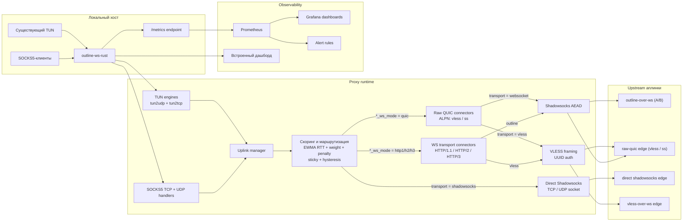

<p align="center">
  
</p>

# outline-ws-rust

`outline-ws-rust` — production-ориентированный Rust-прокси, который принимает локальный SOCKS5-трафик и перенаправляет его на Outline-совместимые WebSocket-транспорты по HTTP/1.1, HTTP/2 или HTTP/3, на прямые Shadowsocks socket uplink'и, на VLESS-over-WebSocket аплинки, либо на raw QUIC аплинки (Shadowsocks / VLESS прямо поверх QUIC-стримов и датаграмм, без WebSocket).

Поддерживает:

- SOCKS5 `CONNECT`
- SOCKS5 `UDP ASSOCIATE` и `hev-socks5` `UDP-in-TCP` (`CMD=0x05`)
- failover и балансировку нагрузки между несколькими аплинками
- WebSocket-over-HTTP/1.1, RFC 8441 (`ws-over-h2`) и RFC 9220 (`ws-over-h3`)
- raw QUIC транспорт (per-ALPN: `vless`, `ss`, `h3`) — VLESS / Shadowsocks-кадры прямо поверх QUIC bidi-стримов и датаграмм (RFC 9221), без WebSocket / HTTP/3
- VLESS-over-WebSocket аплинки (UUID-аутентификация, общий WSS dial path, per-destination UDP session-mux)
- прямые Shadowsocks TCP/UDP socket uplink'и
- метрики Prometheus, встроенный multi-instance дашборд и готовые дашборды Grafana
- интеграцию с существующим TUN-устройством для `tun2udp`
- stateful `tun2tcp`-реле с production-ориентированными ограничениями

---

*English version: [README.md](README.md)*

## Обзор

На верхнем уровне процесс выполняет пять задач:

1. Принимает локальный SOCKS5 и опциональный TUN-трафик.
2. Выбирает лучший доступный аплинк с помощью health-проб, EWMA RTT-скоринга, sticky-маршрутизации, гистерезиса, штрафов и warm standby.
3. Подключается к Outline WebSocket-транспорту в запрошенном режиме (`http1`, `h2` или `h3`) с автоматическим fallback, к raw QUIC аплинку (`quic`; пара к ALPN-листенеру на сервере, на провал dial / handshake падает на WS over H2 → H1), либо к прямому Shadowsocks socket / VLESS-over-WebSocket аплинку.
4. Шифрует payload с помощью Shadowsocks AEAD или формирует VLESS-кадры с UUID-аутентификацией перед отправкой в upstream.
5. Публикует метрики Prometheus для runtime, аплинков, проб, TUN и `tun2tcp`.

## Архитектура



## Поддерживаемые возможности

### SOCKS5

- SOCKS5 без аутентификации
- Опциональная аутентификация по логину/паролю (`RFC 1929`)
- TCP `CONNECT`
- UDP `ASSOCIATE`
- `hev-socks5` `FWD UDP` / `UDP-in-TCP` (`CMD=0x05`)
- совместимость с pipelined SOCKS5-handshake из `hev-socks5-tunnel`
- пересборка UDP-фрагментов SOCKS5 на входящем клиентском трафике
- цели IPv4, IPv6 и по доменному имени
- декларативный policy routing по CIDR назначения с файловыми списками и hot-reload на правило, per-rule fallback (`fallback_via` / `fallback_direct` / `fallback_drop`) и встроенными таргетами `direct` / `drop`

### Outline-транспорты

- `ws://` и `wss://`
- HTTP/1.1 Upgrade
- RFC 8441 WebSocket over HTTP/2
- RFC 9220 WebSocket over HTTP/3 / QUIC
- raw QUIC (per-ALPN, без WebSocket / HTTP/3): выбирается через `*_ws_mode = "quic"`. ALPN `vless` несёт VLESS-TCP (один bidi на сессию) и VLESS-UDP (per-target control bidi + датаграммы, демукс по 4-байтному `session_id`, выдаваемому сервером). ALPN `ss` несёт Shadowsocks-TCP (один bidi на сессию) и Shadowsocks-UDP (1 датаграмма = 1 SS-AEAD пакет, RFC 9221). Несколько сессий с одинаковым ALPN на тот же `host:port` шарят один кэшированный QUIC-коннект. Вспомогательные ALPN `vless-mtu` / `ss-mtu` несут UDP-пакеты, превысившие лимит датаграммы QUIC, поверх server-initiated bidi. На провал dial / handshake raw-QUIC падает на WS over H2 (далее H1) и открывает окно H3-downgrade — следующие дайлы пропускают QUIC, пока recovery-проба не подтвердит, что QUIC снова доступен.
- прямые Shadowsocks TCP/UDP socket uplink'и
- VLESS-over-WebSocket аплинки (`transport = "vless"`, UUID-аутентификация, общий WSS dial path с `websocket`, per-destination UDP session-mux с границей `vless_udp_max_sessions`)
- transport fallback:
  - `h3 -> h2 -> http1`
  - `h2 -> http1`
  - `quic -> h2 -> http1` на провал dial / handshake, с per-uplink окном mode-downgrade (управляется `h3_downgrade_secs`, принимается также как `mode_downgrade_secs`) — следующие дайлы пропускают QUIC, пока recovery-проба не подтвердит его снова
- кросс-транспортное возобновление сессии на стороне клиента: WebSocket Upgrade несёт `X-Outline-Resume-Capable: 1`; Session ID, выданный сервером в `X-Outline-Session`, кэшируется по аплинку (а внутри VLESS UDP mux — по (uplink, target)) и предъявляется как `X-Outline-Resume: <hex>` на следующем on-demand dial — сервер outline-ss-rust с включённой фичей переcаживает клиента на припаркованный upstream, минуя connect к таргету. Покрытие: TCP-WS, SS-UDP-WS, VLESS-TCP raw QUIC (через Addons opcodes) и VLESS-UDP raw QUIC. Opt-in на проводе, без overhead'а если сервер не поддерживает.

### Шифрование

- `chacha20-ietf-poly1305`
- `aes-128-gcm`
- `aes-256-gcm`
- `2022-blake3-aes-128-gcm`
- `2022-blake3-aes-256-gcm`
- `2022-blake3-chacha20-poly1305`

### Управление аплинками

- несколько аплинков
- выбор по принципу «быстрейший первый»
- режим выбора:
  - `active_active`: новые потоки могут использовать разные аплинки в зависимости от скора, sticky и failover
  - `active_passive`: удерживать текущий выбранный аплинк, пока он не станет нездоровым или не войдёт в cooldown
- область маршрутизации:
  - `per_flow`: решения принимаются независимо для каждого ключа маршрутизации / цели
  - `per_uplink`: один активный аплинк разделяется на уровне процесса для каждого транспорта (`tcp` и `udp`); в режиме `active_passive` закреплённые TCP и UDP аплинки не истекают по `sticky_ttl`, установленные SOCKS TCP-туннели остаются закреплёнными за аплинком, который завершил setup, а немигрируемые потоки, всё ещё зависящие от старого активного аплинка, могут быть пересозданы или закрыты после переключения, история штрафов не влияет на строгий per-transport скор
  - `global`: один общий активный аплинк используется для всего нового трафика процесса через `tcp` и `udp`; выбор намеренно смещён в сторону TCP-здоровья, активный глобальный аплинк не истекает по `sticky_ttl`, строгий выбор остаётся закреплённым пока текущий не уйдёт в cooldown, история штрафов не влияет на строгий глобальный скор, TUN-потоки, закреплённые за старым аплинком, активно закрываются после глобального переключения
- статический `weight` на аплинк
- EWMA RTT-скоринг
- модель штрафов за сбои с затуханием
- sticky-маршрутизация с TTL
- гистерезис для исключения лишних переключений
- runtime failover
- auto-failback отключён по умолчанию (`auto_failback = false`): переключение только при сбое, никогда не возвращается на восстановившийся primary самостоятельно
- warm-standby WebSocket-пулы для TCP и UDP
- персистентность выбора активного аплинка между рестартами (TOML state-файл, debounced async-запись)

### Health-пробы

- WebSocket connectivity-пробы (handshake TCP+TLS+WS; без ping/pong — серверы редко отвечают на WebSocket ping control frames)
- реальные HTTP-пробы через `websocket-stream`
- реальные DNS-пробы через `websocket-packet`
- ограничение параллельности проб
- отдельная изоляция dial'ов для проб
- немедленное пробуждение probe loop при runtime-сбое для ускорения обнаружения
- счётчик последовательных успехов для стабильного auto-failback

### TUN

- только интеграция с существующим TUN-устройством
- `tun2udp` с управлением жизненным циклом потоков, сборкой IPv4/IPv6 IP-фрагментов и локальными ICMP echo replies
- stateful `tun2tcp`-реле с ретрансмитом, zero-window persist/backoff, SACK-aware логикой приёма/отправки, adaptive RTO и bounded buffering

### Операционная поддержка

- метрики Prometheus
- встроенный multi-instance дашборд
- готовые дашборды Grafana
- hardened systemd unit
- Linux `fwmark` / `SO_MARK`
- IPv6-совместимые слушатели, upstream'ы, пробы и SOCKS5-цели

## Текущие ограничения

Проект намеренно практичен, но ограничения есть:

- `tun2tcp` ориентирован на production, но всё ещё не эквивалентен ядерному TCP-стеку.
- Не-echo ICMP на TUN не поддерживаются.
- HTTP-проба поддерживает только `http://`, не `https://`; `probe.tcp` должен указывать на сервис, который сам первым отправляет данные, например SSH или SMTP, а не на типичный HTTP/HTTPS-порт.
- TCP failover безопасен до начала полезного обмена данными; живые установленные TCP-туннели не мигрируют прозрачно между аплинками.

## Структура репозитория

- [`config.toml`](config.toml) — пример конфигурации (TOML)
- [`systemd/outline-ws-rust.service`](systemd/outline-ws-rust.service) — hardened systemd unit
- [`grafana/outline-ws-rust-dashboard.json`](grafana/outline-ws-rust-dashboard.json) — основной операционный дашборд
- [`grafana/outline-ws-rust-tun-tcp-dashboard.json`](grafana/outline-ws-rust-tun-tcp-dashboard.json) — дашборд `tun2tcp`
- [`grafana/outline-ws-rust-native-burst-dashboard.json`](grafana/outline-ws-rust-native-burst-dashboard.json) — диагностика стартового и переключательного burst в native Shadowsocks
- [`src/proxy/`](src/proxy) — обработчики TCP/UDP ingress для SOCKS5
- [`crates/outline-uplink/`](crates/outline-uplink) — выбор аплинка, пробы, failover и standby-логика
- [`crates/outline-transport/`](crates/outline-transport) — WebSocket / HTTP-2 / HTTP-3 / raw-QUIC / VLESS / direct-Shadowsocks транспорты + кросс-транспортный `ResumeCache`
- [`crates/outline-net/`](crates/outline-net) — DNS-cache и общий net-обвес, вынесенный из `outline-transport`
- [`crates/outline-ss2022/`](crates/outline-ss2022) — хелперы фреймирования Shadowsocks 2022
- [`crates/outline-tun/`](crates/outline-tun) — stateful TUN relay engines
- [`crates/outline-metrics/`](crates/outline-metrics) — регистрация Prometheus-метрик и session/transport snapshots
- [`crates/outline-routing/`](crates/outline-routing) — CIDR-таблица роутинга
- [`crates/socks5-proto/`](crates/socks5-proto) — примитивы протокола SOCKS5
- [`crates/shadowsocks-crypto/`](crates/shadowsocks-crypto) — криптография и TLS glue
- [`PATCHES.md`](PATCHES.md) — реестр локальных патчей vendored-зависимостей

## Сборка

### Требования

- Rust toolchain (stable): `rustup update stable`
- Для кросс-компиляции: [`cargo-zigbuild`](https://github.com/rust-cross/cargo-zigbuild) — использует компилятор Zig в качестве C-линкера, что избавляет от необходимости ставить отдельный cross-toolchain для каждой платформы.

```bash
cargo install cargo-zigbuild
```

Доступные shortcuts в этом репозитории:

```bash
cargo release-musl-x86_64
cargo release-musl-aarch64
cargo release-router-musl-arm
cargo release-router-musl-armv7
cargo release-router-musl-aarch64
```

### CI-релизы

- Каждый push в `main` запускает workflow `Nightly Release`.
- Этот workflow передвигает rolling tag `nightly` на текущий коммит `main` и заново публикует GitHub prerelease `Nightly`.
- Nightly публикует server-артефакты `release` для `x86_64-unknown-linux-musl` и `aarch64-unknown-linux-musl`, router-артефакты `release-router` для `x86_64-unknown-linux-musl` и `aarch64-unknown-linux-musl`, а также `SHA256SUMS.txt`.
- Nightly server-архивы называются `outline-ws-rust-vnightly-<full-commit-sha>-<target>.tar.gz`; для router используется префикс `outline-ws-rust-router-vnightly-<full-commit-sha>-<target>.tar.gz`.
- Для стабильного релиза запускайте вручную workflow `Release` и передавайте `major_minor`, например `1.7`.
- CI находит последний тег вида `v1.7.*`, автоматически увеличивает patch, обновляет `Cargo.toml` и `Cargo.lock`, создает release-коммит и пушит этот коммит в `main`.
- После появления release-коммита в `main` нужно локально создать и отправить подписанный тег; именно push тега запускает workflow `Tag Release`, который собирает и публикует GitHub Release.
- В результате один стабильный GitHub Release содержит и server-артефакты `release` для `x86_64-unknown-linux-musl` и `aarch64-unknown-linux-musl`, и router-артефакты `release-router` для `x86_64-unknown-linux-musl` и `aarch64-unknown-linux-musl`.
- Router-архивы называются `outline-ws-rust-router-v<version>-<target>.tar.gz`, чтобы не пересекаться с обычными server-артефактами.
- Если нужно, push тега вида `v1.2.3` по-прежнему запускает workflow `Tag Release` как отдельный внешний tag-driven путь.

Добавить нужные Rust-таргеты:

```bash
# Виртуалки / серверы
rustup target add x86_64-unknown-linux-musl
rustup target add aarch64-unknown-linux-musl

# Роутеры (ARM, напр. Raspberry Pi, большинство современных домашних роутеров)
rustup target add armv7-unknown-linux-musleabihf
# Роутеры (AArch64, напр. новые Raspberry Pi, Banana Pi, роутеры с Cortex-A53+)
rustup target add aarch64-unknown-linux-musl
```

Текущий stable Rust больше не отдает `mips-unknown-linux-musl` и `mipsel-unknown-linux-musl` как скачиваемые `rust-std` targets, поэтому локальные shortcuts в документации покрывают только цели, которые еще доступны на stable. Для legacy MIPS-сборок теперь нужен либо pinned старый toolchain, либо кастомный `build-std` flow; официальные stable release-артефакты для этих целей собираются в CI через workflow `Release`.

---

### Feature flags

Бинарь управляется Cargo feature flags. Комбинируйте по необходимости:

| Фича | По умолч. | Эффект |
|---|---|---|
| `h3` | ✓ | Транспорт H3/QUIC (тянет quinn + sockudo-ws/http3) |
| `metrics` | ✓ | Prometheus-метрики; включает также метрики транспортного уровня (тянет prometheus + serde_json) |
| `tun` | ✓ | Поддержка TUN-устройств (движки tun2udp + tun2tcp); отключить, чтобы полностью убрать TUN-код |
| `mimalloc` | ✓ | Заменяет системный аллокатор на mimalloc; снижает RSS-фрагментацию при большом потоке соединений |
| `env-filter` | ✓ | Динамический парсинг `RUST_LOG`; отключить, чтобы жёстко задать уровень `WARN` и сэкономить ~300 КБ на MIPS |
| `multi-thread` | ✓ | Work-stealing планировщик Tokio; отключить, чтобы принудительно использовать `current_thread` и сэкономить ~100–200 КБ |
| `router` | — | Удобный псевдоним для `--no-default-features --features router` (отключает все дефолтные фичи выше) |

> **Почему отключать на роутерах:** `h3`/QUIC добавляет ~1–2 МБ к бинарю и накладные расходы на MIPS/ARM. `metrics` добавляет prometheus + serde_json и фоновый sampler. `router` отключает оба сразу.

---

### Виртуальные машины и серверы

Нативная сборка для текущей машины (быстрее всего, использует все CPU-расширения):

```bash
cargo build --release
```

Статический бинарь x86-64 (работает на любом Linux x86-64 без зависимости от glibc):

```bash
cargo zigbuild --release --target x86_64-unknown-linux-musl
# или короче
cargo release-musl-x86_64
```

Статический бинарь AArch64 (ARM64-серверы, AWS Graviton, Ampere):

```bash
cargo zigbuild --release --target aarch64-unknown-linux-musl
# или короче
cargo release-musl-aarch64
```

Отключить только одну фичу, сохранив остальные (напр. убрать метрики, оставив H3):

```bash
cargo zigbuild --release --no-default-features --features h3 --target x86_64-unknown-linux-musl
```

---

### Роутеры (кросс-компиляция)

Все сборки для роутеров используют `musl` libc — полностью статический бинарь без runtime-зависимостей.
На устройстве используйте `config-router.toml` — см. [Конфигурация для роутера](#конфигурация-для-роутера).

Все роутерные сборки используют `--no-default-features --features router`, что отключает:
- `h3` → убирает quinn, h3, h3-quinn, sockudo-ws/http3 (~1–2 МБ меньше на MIPS)
- `metrics` → убирает prometheus, serde_json, фоновый process sampler

Роутерные сборки используют профиль `release-router` (`opt-level = "z"`) — оптимизация по размеру бинаря вместо скорости. Для ВМ используется `release` (`opt-level = 3`).

**ARM soft-float** (минималистичные ARM-роутеры без FPU, напр. старые Linksys WRT):

```bash
cargo zigbuild --profile release-router --no-default-features --features router --target arm-unknown-linux-musleabi
# или короче
cargo release-router-musl-arm
```

**ARMv7 hard-float** (Raspberry Pi 2/3 в 32-битном режиме, многие mid-range роутеры):

```bash
cargo zigbuild --profile release-router --no-default-features --features router --target armv7-unknown-linux-musleabihf
# или короче
cargo release-router-musl-armv7
```

**AArch64 / ARM64** (Raspberry Pi 3/4/5 в 64-битном режиме, Banana Pi R3/R4, NanoPi R5S, роутеры с MT7986/MT7988, IPQ8074):

```bash
cargo zigbuild --profile release-router --no-default-features --features router --target aarch64-unknown-linux-musl
# или короче
cargo release-router-musl-aarch64
```

Скомпилированный бинарь находится в `target/<target>/release-router/outline-ws-rust`.
Скопировать на роутер и сделать исполняемым:

```bash
scp target/armv7-unknown-linux-musleabihf/release-router/outline-ws-rust root@192.168.1.1:/usr/local/bin/
ssh root@192.168.1.1 chmod +x /usr/local/bin/outline-ws-rust
```

> `router` — просто псевдоним: сам по себе не устанавливает флагов, просто позволяет написать `--features router` вместо `--no-default-features`.

### Release-артефакты для роутеров

Stable Rust больше не поставляет готовый `rust-std` для `mips-unknown-linux-musl` / `mipsel-unknown-linux-musl`, поэтому такие сборки теперь требуют nightly и `build-std`. Для локальной сборки по-прежнему нужен рабочий MIPS musl toolchain или эквивалентная схема с Zig-обертками; самый простой и надежный путь для официальных stable-артефактов сейчас — workflow `Release`.

Локальный пример, если такой toolchain уже есть:

```bash
rustup toolchain install nightly --component rust-src
cargo +nightly build -Z build-std=std,panic_abort --profile release-router --no-default-features --features router --target mipsel-unknown-linux-musl
```

Пример через CI / релиз:

- вручную запускаете workflow `Release` для обычного стабильного релиза или пушите тег вида `v1.2.3` для внешнего tag-driven пути
- workflow `Release` публикует один GitHub Release и для server-, и для router-артефактов
- для `aarch64-unknown-linux-musl` router-бинарь собирается через `cargo-zigbuild`
- для `mips` и `mipsel` внутри используется nightly `build-std`, Zig и генерируемые wrapper-скрипты, которые мапятся на Zig musl EABI targets, без загрузки внешнего toolchain-архива
- опубликованные router-архивы называются `outline-ws-rust-router-v<version>-<target>.tar.gz`

---

### Конфигурация для роутера

Используйте `config-router.toml` как отправную точку для устройств с ограниченной памятью.

**Фичи сборки:**

| Фича | ВМ | Роутер (`--no-default-features --features router`) |
|---|---|---|
| `h3` | ✓ | ✗ → H3 тихо падает на H2 |
| `metrics` | ✓ | ✗ → все вызовы метрик — no-op, `/metrics` не работает |
| `env-filter` | ✓ | ✗ → уровень логирования жёстко `WARN` (экономия ~300 КБ, без regex) |
| `multi-thread` | ✓ | ✗ → всегда планировщик `current_thread` (экономия ~100–200 КБ) |

**Runtime-параметры (конфиг / CLI):**

| Параметр | ВМ (по умолчанию) | Роутер (пример) |
|---|---|---|
| `RUST_LOG` (env) | настраивается (по умолч.: `info,outline_ws_rust=debug`) | жёстко `WARN` (без regex) |
| `--worker-threads` | кол-во CPU | N/A (всегда `current_thread`) |
| `--thread-stack-size-kb` | 2048 КБ | N/A (`multi-thread` отключён) |
| `udp_recv_buf_bytes` | дефолт ядра | напр. `212992` (208 КБ) |
| `udp_send_buf_bytes` | дефолт ядра | напр. `212992` (208 КБ) |
| `tun.max_flows` | 4096 | 128 |
| `tun.defrag_max_fragment_sets` | 1024 | 64 |
| `tun.defrag_max_fragments_per_set` | 64 | 16 |
| `tun.defrag_max_total_bytes` | 16 МБ | 2 МБ |
| `tun.defrag_max_bytes_per_set` | 128 КБ | 16 КБ |
| `tun.tcp.max_pending_server_bytes` | 4 МБ | 64 КБ |
| `tun.tcp.max_buffered_client_bytes` | 256 КБ | 64 КБ |
| `[h2] initial_stream_window_size` | 1 МБ | 256 КБ |
| `[h2] initial_connection_window_size` | 2 МБ | 512 КБ |
| Warm standby | 1 TCP + 1 UDP | отключено |
| Режим балансировки | `active_active` | `active_passive` |
| Транспорт | `h3` | `h2` (QUIC тяжелее для MIPS/ARM) |
| `state_path` | директория конфига (`.state.toml`) | указать на записываемый путь, например `/var/lib/outline-ws-rust/state.toml` |

Запуск с роутерным конфигом:

```bash
outline-ws-rust --config /etc/outline-ws-rust/config-router.toml --worker-threads 1
```

Или через переменные окружения:

```bash
PROXY_CONFIG=/etc/outline-ws-rust/config-router.toml WORKER_THREADS=1 outline-ws-rust
```

> Роутерные сборки логируют только на уровне `WARN` — `RUST_LOG` игнорируется. Чтобы получить динамический уровень, добавьте `--features env-filter` к команде сборки (ценой ~300 КБ на MIPS).

## Быстрый старт

Минимальный локальный запуск через `config.toml`:

```bash
cargo run --release
```

Пример запуска с переопределением параметров через CLI:

```bash
cargo run --release -- \
  --listen [::]:1080 \
  --tcp-ws-url wss://example.com/SECRET/tcp \
  --tcp-ws-mode h3 \
  --udp-ws-url wss://example.com/SECRET/udp \
  --udp-ws-mode h3 \
  --method chacha20-ietf-poly1305 \
  --password 'Secret0'
```

Пример настроек клиента:

- SOCKS5 host: `::1` или `127.0.0.1`
- SOCKS5 port: `1080`

При `listen = "[::]:1080"` большинство систем создают dual-stack слушатель. Если ваша платформа не проксирует IPv4 через IPv6 сокеты, добавьте отдельный IPv4-слушатель.

### Совместимость с `hev-socks5-tunnel`

`outline-ws-rust` принимает оба UDP-режима, которые использует [`hev-socks5-tunnel`](https://github.com/heiher/hev-socks5-tunnel):

```yaml
socks5:
  address: '127.0.0.1'
  port: 1080
  udp: 'udp'      # стандартный SOCKS5 UDP ASSOCIATE
  # udp: 'tcp'    # hev FWD UDP / UDP-in-TCP (CMD=0x05)
  # pipeline: true
```

- `udp: 'udp'` использует стандартный SOCKS5 `UDP ASSOCIATE`.
- `udp: 'tcp'` использует проприетарный TCP-несущий UDP relay из `hev-socks5` (`CMD=0x05`), который тоже поддержан.
- `pipeline: true` тоже принимается, в том числе вместе с username/password-аутентификацией.

## Конфигурация

По умолчанию процесс читает [`config.toml`](config.toml).

Пример:

```toml
[socks5]
# Опционально. Если секции или listen нет, SOCKS5 listener не поднимается.
listen = "[::]:1080"
# Опциональная локальная SOCKS5-аутентификация для клиентов.
#
# [[socks5.users]]
# username = "alice"
# password = "secret1"
#
# [[socks5.users]]
# username = "bob"
# password = "secret2"

[metrics]
listen = "[::1]:9090"

# Control plane (mutating endpoints, например /switch). Должен слушать
# на отдельном сокете от [metrics] и всегда защищён bearer-токеном.
# Без секции мутирующие эндпоинты недоступны.
# [control]
# listen = "127.0.0.1:9091"
# token = "long-random-secret"
# # Либо читать токен из соседнего файла (путь — относительно конфига).
# # Используйте, когда секрет нельзя хранить в самом конфиге.
# # token_file = "/etc/outline-ws/control.token"

# Встроенный multi-instance дашборд. Откройте http://LISTEN/dashboard.
# Секреты хранятся только в конфиге процесса с дашбордом; браузеру они не
# отдаются. Каждая instance должна иметь включённый [control].
# [dashboard]
# listen = "127.0.0.1:9092"
# refresh_interval_secs = 5
# # Таймаут HTTP-запроса к control каждой instance (по умолчанию 5s).
# request_timeout_secs = 5
#
# [[dashboard.instances]]
# name = "inst-01"
# # http:// или https:// — TLS-эндпоинты control поддерживаются.
# control_url = "http://127.0.0.1:9091"
# token_file = "/etc/outline-ws/inst-01.control.token"
#
# [[dashboard.instances]]
# name = "inst-02"
# control_url = "https://10.0.0.12:9091"
# token = "long-random-secret"

[tun]
# Путь к существующему TUN-устройству. Создание, IP-адреса и маршруты — вне приложения.
# Linux:
# path = "/dev/net/tun"
# name = "tun0"
# macOS / BSD:
# path = "/dev/tun0"
# mtu = 1500
# max_flows = 4096
# idle_timeout_secs = 300

# [tun.tcp]
# connect_timeout_secs = 10
# handshake_timeout_secs = 15
# half_close_timeout_secs = 60
# max_pending_server_bytes = 4194304
# backlog_abort_grace_secs = 3
# backlog_hard_limit_multiplier = 2
# backlog_no_progress_abort_secs = 8
# max_buffered_client_segments = 4096
# max_buffered_client_bytes = 262144
# max_retransmits = 12

# [outline.probe] — шаблон, наследуемый каждой [[uplink_group]];
# конкретные группы могут переопределить любое поле через [uplink_group.probe].
[outline.probe]
interval_secs = 30
timeout_secs = 10
max_concurrent = 4
max_dials = 2
min_failures = 1

[outline.probe.ws]
enabled = true

[outline.probe.http]
url = "http://example.com/"

# `outline.probe.http` отправляет HTTP `HEAD`, а не `GET`, чтобы health-check
# не тянул тело ответа через uplink.

[outline.probe.dns]
server = "1.1.1.1"
port = 53
name = "example.com"

# Каждая группа — изолированный UplinkManager со своим probe loop, standby
# pool, sticky-routes, активным аплинком и LB-политикой.
# Обратите внимание: [[uplink_group]] остаётся на верхнем уровне, не под [outline].
[[uplink_group]]
name = "main"
mode = "active_active"
routing_scope = "per_flow"
warm_standby_tcp = 1
warm_standby_udp = 1
sticky_ttl_secs = 300
hysteresis_ms = 50
failure_cooldown_secs = 10
tcp_chunk0_failover_timeout_secs = 10
rtt_ewma_alpha = 0.3
failure_penalty_ms = 500
failure_penalty_max_ms = 30000
failure_penalty_halflife_secs = 60
h3_downgrade_secs = 60
# auto_failback = false
# Границы VLESS UDP session-mux (используются только аплинками transport = "vless").
# vless_udp_max_sessions = 256              # LRU-вытеснение свыше этого числа целей
# vless_udp_session_idle_secs = 60          # 0 отключает idle-эвикцию
# vless_udp_janitor_interval_secs = 15

# Аплинки живут под [outline]. Каждая запись [[outline.uplinks]] должна
# содержать `group = "..."`, совпадающее с [[uplink_group]].name выше.
[[outline.uplinks]]
name = "primary"
group = "main"
transport = "websocket"
tcp_ws_url = "wss://example.com/SECRET/tcp"
weight = 1.0
tcp_ws_mode = "h3"
# fwmark = 100
# ipv6_first = true
udp_ws_url = "wss://example.com/SECRET/udp"
udp_ws_mode = "h3"
method = "chacha20-ietf-poly1305"
password = "Secret0"

[[outline.uplinks]]
name = "backup"
group = "main"
transport = "websocket"
tcp_ws_url = "wss://backup.example.com/SECRET/tcp"
weight = 0.8
tcp_ws_mode = "h2"
udp_ws_url = "wss://backup.example.com/SECRET/udp"
udp_ws_mode = "h2"
method = "chacha20-ietf-poly1305"
password = "Secret0"

# VLESS-over-WebSocket аплинк. Использует тот же WSS-путь дозвона, что и
# transport = "websocket"; `vless_id` заменяет Shadowsocks-овые cipher/password.
# Сервер VLESS открывает один WS-путь (`ws_path_vless`), общий для TCP и
# UDP, поэтому в клиентском конфиге задаётся одна пара
# `vless_ws_url`/`vless_ws_mode` — поля `tcp_ws_url`/`udp_ws_url` для
# `transport = "vless"` запрещены и парсер отвергнет их с явной ошибкой.
[[outline.uplinks]]
name = "vless-edge"
group = "main"
transport = "vless"
vless_ws_url = "wss://vless.example.com/SECRET/vless"
vless_ws_mode = "h2"
vless_id = "11111111-2222-3333-4444-555555555555"
weight = 0.5

# VLESS поверх raw QUIC (ALPN = "vless"). Установка vless_ws_mode = "quic"
# обходит WebSocket-слой целиком: VLESS-кадры идут прямо по QUIC bidi
# (TCP) и QUIC-датаграммам (UDP, с 4-байтным префиксом session_id,
# выдаваемым сервером). Из URL берётся только host:port. На провал
# dial / handshake raw-QUIC падает на WS over H2 (далее H1) и открывает
# окно H3-downgrade — следующие дайлы пропускают QUIC, пока recovery-
# проба не подтвердит его снова.
[[outline.uplinks]]
name = "vless-quic"
group = "main"
transport = "vless"
vless_ws_url = "https://vless.example.com:443"
vless_ws_mode = "quic"
vless_id = "11111111-2222-3333-4444-555555555555"
weight = 1.0

# Shadowsocks поверх raw QUIC (ALPN = "ss"). Один QUIC bidi на SS-TCP
# сессию; SS-UDP едет в QUIC-датаграммах 1-к-1 c SS-AEAD пакетами.
# Cipher / password те же, что в WS-варианте. transport = "websocket" +
# tcp_ws_mode = "quic" — это SS-over-QUIC; transport = "vless" +
# tcp_ws_mode = "quic" — VLESS-over-QUIC (см. выше).
[[outline.uplinks]]
name = "ss-quic"
group = "main"
transport = "websocket"
tcp_ws_url = "https://ss.example.com:443"
udp_ws_url = "https://ss.example.com:443"
tcp_ws_mode = "quic"
udp_ws_mode = "quic"
method = "chacha20-ietf-poly1305"
password = "Secret0"
weight = 1.0

# Опциональный policy-routing: first-match-wins по CIDR назначения.
# `via` принимает имя группы или зарезервированные `direct` / `drop`.
# Если [[route]] отсутствует — весь трафик идёт через первую группу.
[[route]]
prefixes = ["10.0.0.0/8", "172.16.0.0/12", "192.168.0.0/16", "fc00::/7"]
via = "direct"

[[route]]
default = true
via = "main"
```

### Ключевые параметры конфигурации

- `transport` принимает `websocket` (по умолчанию), `shadowsocks` или `vless`. VLESS делит WSS-путь дозвона с `websocket` (те же поля `tcp_ws_url` / `udp_ws_url` / `tcp_ws_mode` / `udp_ws_mode` / `ipv6_first` / `fwmark`), но аутентифицируется одним `vless_id` вместо пары Shadowsocks `method` + `password`. VLESS UDP открывает по одной WSS-сессии на каждое назначение внутри аплинка (ограничено `[outline.load_balancing] vless_udp_max_sessions` с LRU-вытеснением; idle-эвикция управляется `vless_udp_session_idle_secs`).
- Должен быть настроен хотя бы один ingress: `--listen` / `[socks5].listen` и/или `[tun]`. Если не задано ни то ни другое, процесс завершится с ошибкой вместо молчаливого bind на `127.0.0.1:1080`.
- `tcp_ws_mode` / `udp_ws_mode` (для `transport = "ws"`) и `vless_ws_mode` (для `transport = "vless"`) принимают `http1` (алиас `h1`), `h2`, `h3` или `quic`. Режимы `http1` / `h2` / `h3` едут поверх WebSocket Upgrade на соответствующей версии HTTP (с автоматическим fallback `h3 → h2 → http1` для WS-режимов); `quic` выбирает raw QUIC framing на ALPN `vless` (для VLESS) или `ss` (для Shadowsocks-over-WS) с dial-time fallback `quic → h2 → http1`.
- `tcp_addr` / `udp_addr` используются с `transport = "shadowsocks"` и принимают `host:port` или `[ipv6]:port`.
- `ipv6_first` (по умолчанию `false`) меняет предпочтение адресов после DNS для этого uplink с IPv4-first на IPv6-first для TCP, UDP, H1, H2 и H3 соединений.
- `method` также поддерживает `2022-blake3-aes-128-gcm`, `2022-blake3-aes-256-gcm` и `2022-blake3-chacha20-poly1305`; для них `password` должен быть base64-кодированным PSK точной длины ключа выбранного шифра.
- `[[socks5.users]]` включает локальную SOCKS5-аутентификацию по логину/паролю для нескольких пользователей. В каждой записи должны быть и `username`, и `password`.
- `[socks5] username` + `password` по-прежнему поддерживаются как shorthand для одного пользователя.
- CLI/env-эквиваленты `--socks5-username` / `SOCKS5_USERNAME` и `--socks5-password` / `SOCKS5_PASSWORD` тоже задают одного пользователя.
- Тот же SOCKS5-listener принимает и стандартный `UDP ASSOCIATE`, и `hev-socks5` `UDP-in-TCP` (`CMD=0x05`); отдельный server-side переключатель не нужен.
- `[outline.probe] min_failures` (по умолчанию `1`): количество последовательных неудачных проб, необходимых для объявления аплинка нездоровым. Увеличьте до `2` или `3`, чтобы допускать разовые сбои проб без запуска failover. То же значение используется в качестве порога стабильности последовательных успехов для `auto_failback`.
- `[outline.load_balancing] tcp_chunk0_failover_timeout_secs` (по умолчанию `10`): сколько ждать первых байтов ответа от upstream после последней активности клиента, прежде чем разрешать TCP chunk-0 failover на другой аплинк. Увеличьте это значение, если линки всё ещё переключаются на медленных first-byte ответах. (Применимо к single-group конфигам; для multi-group то же поле живёт на каждом `[[uplink_group]]`.)
- `[outline.load_balancing] auto_failback` (по умолчанию `false`): управляет тем, возвращает ли прокси трафик на восстановившийся аплинк с более высоким приоритетом.
  - `false` (по умолчанию): активный аплинк заменяется **только при сбое**. Как только прокси переключился на резервный, он остаётся на нём, пока не упадёт сам резервный — никакого автоматического возврата на primary. Рекомендуется для production, чтобы исключить лишние обрывы соединений.
  - `true`: если текущий активный аплинк здоров, но существует кандидат с **более высоким `weight`** (или равным weight и меньшим индексом в конфиге), прокси может вернуть трафик на него — но только после того, как кандидат накопит `min_failures` последовательных успешных циклов проб. Приоритет определяется `weight`, а не EWMA RTT: это исключает ложные переключения под нагрузкой, когда EWMA активного аплинка временно растёт из-за медленных соединений, а idle-резервный выглядит лучше по latency. Failback всегда движется в сторону большего `weight` (`1.0 → 1.5 → 2.0`): переключение на аплинк с меньшим weight через auto_failback невозможно — это failover, который требует probe-подтверждённого сбоя.
- `h3_downgrade_secs` (per-group, по умолчанию `60`, принимается также как `mode_downgrade_secs`): сколько секунд аплинк, получивший сбой на «продвинутом» режиме (H3 application-level error либо провал dial / handshake raw QUIC) — для `transport = "ws"` и `transport = "vless"`, — будет использовать H2-fallback (далее H2 → H1 при необходимости внутри `connect_websocket_with_source`) перед повторной попыткой исходного режима. Установите `0`, чтобы отключить автоматический даунгрейд.
- `state_path` (опционально): путь к TOML-файлу, в котором сохраняется выбор активного аплинка между рестартами. По умолчанию — путь к конфигу с заменой расширения на `.state.toml` (например, `config.toml` → `config.state.toml`). Если файл не удаётся открыть на запись (например, конфиг находится в `/etc/` с `ProtectSystem=strict`), при старте выводится предупреждение и процесс продолжает работу без персистентности. Прилагаемые systemd-юниты задают `STATE_PATH=/var/lib/outline-ws-rust/state.toml`, чтобы состояние попадало в записываемую директорию. Сохраняется только выбор активного аплинка (по имени); EWMA и штрафы не сохраняются — они восстанавливаются за один цикл проб после рестарта.
- Группы аплинков (`[[uplink_group]]`) полностью изолированы в runtime: у каждой свой probe loop, standby pool, sticky-routes, активный аплинк и load-balancing политика.
- `[outline.probe]` — шаблон: каждая группа его наследует, а `[uplink_group.probe]` переопределяет поля по отдельности. Подтаблицы пробников (`ws`/`http`/`dns`/`tcp`) заменяются целиком — если группа задаёт `[uplink_group.probe.http]`, шаблонный `[outline.probe.http]` для неё игнорируется.
- Имена аплинков должны быть глобально уникальны по всем группам (Prometheus-метрики пока используют лейбл `uplink="..."` без квалификатора группы).
- Устаревшая секция `[bypass]` удалена. Мигрируйте bypass-префиксы в `[[route]]` с `via = "direct"`. Загрузка конфига с оставшейся `[bypass]`-таблицей завершится с явным сообщением о миграции.
- Аплинки, шаблон пробника и настройки load-balancing живут под `[outline]` (`[[outline.uplinks]]`, `[outline.probe]`, `[outline.load_balancing]`). Старая плоская форма с top-level `tcp_ws_url` / `[probe]` / `[[uplinks]]` / `[load_balancing]` по-прежнему принимается для обратной совместимости и на старте логирует deprecation-предупреждение — мигрируйте в секцию `[outline]`. Без `[[uplinks]]` top-level `tcp_ws_url` / `password` / CLI-флаги (`--tcp-ws-url`, `--password`, ...) синтезируют single-uplink группу `default` как shorthand.
- Флаги CLI и переменные окружения переопределяют настройки из файла.
- `--metrics-listen` включает метрики даже без секции `[metrics]` в конфиге.
- `--control-listen` / `CONTROL_LISTEN` и `--control-token` / `CONTROL_TOKEN` включают control plane без секции `[control]`. Оба значения должны быть заданы вместе; одно без другого приводит к ошибке старта.
- `--tun-path` включает TUN даже без секции `[tun]` в конфиге.
- `direct_fwmark` (опционально, top-level): значение `SO_MARK`, применяемое к TCP и UDP сокетам, открываемым для `direct`-маршрутизированных соединений. Используйте, когда bypass-трафик должен быть помечен для OS-level policy routing во избежание петель (например, чтобы bypass-маршрут сам не перехватывался TUN-интерфейсом).
- SOCKS5 → upstream TCP-сессии подвергаются двунаправленному idle timeout в 5 минут. Если в обоих направлениях не проходит ни одного байта в течение 300 секунд, туннель закрывается и FD освобождаются. Любая активность данных в любом направлении сбрасывает таймер. Это предотвращает накопление FD от брошенных соединений, особенно под TUN-интерцепторами, которые открывают множество TCP-сессий и бросают их без FIN.
- Half-open TCP-сессии (клиент отправил EOF, прокси ожидает FIN от upstream) закрываются через 30 секунд. Это предотвращает удержание сокетов в полуоткрытом состоянии, если upstream не подтверждает отключение клиента.

### Полезные переопределения через CLI и переменные окружения

- `--config` / `PROXY_CONFIG`
- `--listen` / `SOCKS5_LISTEN`
- `--socks5-username` / `SOCKS5_USERNAME`
- `--socks5-password` / `SOCKS5_PASSWORD`
- `--tcp-ws-url` / `OUTLINE_TCP_WS_URL`
- `--tcp-ws-mode` / `OUTLINE_TCP_WS_MODE`
- `--udp-ws-url` / `OUTLINE_UDP_WS_URL`
- `--udp-ws-mode` / `OUTLINE_UDP_WS_MODE`
- `--method` / `SHADOWSOCKS_METHOD`
- `--password` / `SHADOWSOCKS_PASSWORD`
- `--metrics-listen` / `METRICS_LISTEN`
- `--tun-path` / `TUN_PATH`
- `--tun-name` / `TUN_NAME`
- `--tun-mtu` / `TUN_MTU`
- `--fwmark` / `OUTLINE_FWMARK`
- `--state-path` / `STATE_PATH`

## Policy routing

Декларативная маршрутизация по CIDR назначения, вычисляется first-match-wins с явным правилом `default = true`. Каждое правило выбирает один из трёх таргетов через `via = "..."`:

- **имя группы** (одной из объявленных `[[uplink_group]]`) — соединение идёт через UplinkManager этой группы;
- **`direct`** — напрямую мимо всех аплинков (эквивалент прежнего `[bypass]`);
- **`drop`** — SOCKS5 `REP=0x02 (connection not allowed)` для TCP, тихий drop для UDP.

Матчинг выполняется по IP-адресу назначения; доменные имена никогда не матчат правило и проваливаются в default.

### Конфигурация маршрутов

```toml
# RFC 1918 / ULA / loopback — никогда через туннель.
[[route]]
prefixes = ["10.0.0.0/8", "172.16.0.0/12", "192.168.0.0/16", "fc00::/7", "127.0.0.0/8", "::1/128"]
via = "direct"

# Страновой / GeoIP-список из файла, hot-reload по mtime.
[[route]]
file = "/etc/outline-ws-rust/geoip-cn.list"
file_poll_secs = 60
via = "backup"
fallback_via = "main"     # пробуем "main", если в "backup" нет healthy-аплинков

# Несколько файлов, объединённых в одно правило — например, IPv4 и IPv6
# списки из разных фидов. Все файлы отслеживаются независимо;
# inline `prefixes` при желании тоже можно добавить — всё смерджится.
[[route]]
files = [
    "/etc/outline-ws-rust/geoip-cn-v4.list",
    "/etc/outline-ws-rust/geoip-cn-v6.list",
]
file_poll_secs = 60
via = "backup"

# Заблокировать диапазон.
[[route]]
prefixes = ["198.51.100.0/24"]
via = "drop"

# Явный default — матчит всё, что не подошло выше.
[[route]]
default = true
via = "main"
fallback_direct = true    # или: fallback_drop = true / fallback_via = "backup"
```

Поля правила:

- `prefixes` / `file` / `files`: inline-список и/или один или несколько путей к файлам (один CIDR на строку, `#` комментарии и пустые строки игнорируются). Все источники мерджатся в CIDR-набор правила. `file` — удобный шорткат для `files` из одного элемента; их можно комбинировать.
- `file_poll_secs`: как часто (в секундах) проверять mtime каждого файла и перечитывать CIDR при изменении. По умолчанию `60`. Применяется к каждому пути из `files`.
- `via`: таргет для матчащего трафика. Обязателен (кроме `default = true`-правила, где выбирает fallthrough).
- `fallback_via` / `fallback_direct` / `fallback_drop`: взаимоисключающие; используются, когда primary-`via` — группа с нулём healthy-аплинков в момент диспатча.
- `default = true`: ровно одно правило должно нести этот флаг; оно матчит всё, что не подошло по предыдущим правилам. `default`-правило не должно задавать `prefixes`, `file` или `files`.

### Матчинг префиксов

Внутренне inline + file префиксы каждого правила мерджатся в [`CidrSet`](src/routing/cidr.rs) — отсортированные `[start, end]` диапазоны (IPv4 как `u32`, IPv6 как `u128`) с объединением перекрывающихся и соседних. Поиск через `partition_point` (бинарный поиск), O(log n) на правило.

### Hot-reload

Для каждого правила хотя бы с одним путём в `file` / `files` запускается фоновая tokio-задача, которая опрашивает `mtime` каждого из перечисленных файлов каждые `file_poll_secs` секунд. При изменении любого из них CIDR-набор правила пересобирается из inline-префиксов и всех перечитанных файлов, после чего атомарно подменяется (`Arc<RwLock<CidrSet>>`) — другие правила и структура таблицы не затрагиваются. Ошибка чтения или парсинга при reload оставляет предыдущий CIDR-набор и пишет warning.

### Idle timeout прямых соединений

`direct`-соединения имеют двунаправленный idle timeout 2 минуты. Если в обоих направлениях не проходит ни одного байта в течение 120 секунд — оба сокета закрываются и FD освобождаются. Это предотвращает неограниченное накопление FD от клиентов, которые открывают TCP-соединения (например, DNS-over-HTTPS, DNS-over-TLS) и бросают их без FIN — при этом сервер держит свою сторону открытой. Любая активность данных в любом направлении сбрасывает таймер, поэтому легитимные долгоживущие push-notification и keepalive соединения не затрагиваются.

### Fallback-семантика

Когда primary-`via` резолвится в группу без healthy-аплинков, пробуется fallback-таргет правила (один уровень, без рекурсии). Health проверяется без побочных эффектов в момент диспатча через `UplinkManager::has_any_healthy(transport)` — дешевле, чем собирать список кандидатов, и не трогает sticky-routes. Если primary-группа восстановится посреди сессии, новые соединения пойдут через неё — fallback консультируется только при диспатче.

## Транспортные режимы

### HTTP/1.1

Используйте, когда нужна максимально совместимая базовая конфигурация.

### HTTP/2

Используйте, когда upstream поддерживает RFC 8441 Extended CONNECT для WebSocket.

### HTTP/3

Используйте, когда upstream поддерживает RFC 9220 и QUIC/UDP доступен end-to-end.

### Raw QUIC

Используйте, когда на сервере поднят соответствующий raw-QUIC listener (`transport::raw_quic` в outline-ss-rust). Выбирается per-uplink через `tcp_ws_mode = "quic"` / `udp_ws_mode = "quic"` (для `transport = "ws"`) или `vless_ws_mode = "quic"` (для `transport = "vless"`). Этот путь полностью обходит WebSocket и HTTP/3 framing:

- VLESS-TCP / SS-TCP — один QUIC bidi на сессию.
- VLESS-UDP — per-target control bidi (сервер выдаёт 4-байтный `session_id`) и connection-level demux датаграмм.
- SS-UDP — 1 QUIC-датаграмма = 1 SS-AEAD пакет (RFC 9221).
- Вспомогательные ALPN `vless-mtu` / `ss-mtu` — stream-fallback для UDP-payload'а, превышающего лимит датаграммы QUIC.
- Несколько сессий с одинаковым ALPN на тот же `host:port` шарят один кэшированный QUIC-коннект.
- Из URL дайла берётся только `host:port`, путь игнорируется.

Рекомендуемый подход:

- предпочитайте `http1` как консервативную базу
- включайте `h2` только если reverse proxy и origin проверены на совместимость с RFC 8441
- включайте `h3` только если QUIC явно поддерживается и доступен
- включайте `quic` только если соответствующий raw-QUIC listener в outline-ss-rust доступен end-to-end

**Общий QUIC-эндпоинт:** H3 и raw-QUIC соединения без per-uplink `fwmark` разделяют один UDP-сокет на address family (один для IPv4, один для IPv6). Это означает, что N warm-standby соединений не открывают N UDP-сокетов. Соединения с `fwmark` по-прежнему используют выделенный сокет, поскольку метка должна быть применена до первого `sendmsg`.

QUIC keep-alive пинги отправляются каждые 10 секунд для предотвращения истечения NAT-маппингов и обнаружения мёртвых соединений.

Runtime fallback:

- запрошенный `h3` пробует `h3`, затем `h2`, затем `http1`
- запрошенный `h2` пробует `h2`, затем `http1`
- запрошенный `quic` на провал dial / handshake пробует raw QUIC, затем WS over `h2`, затем WS over `http1`

**Окно даунгрейда режима:** при сбое «продвинутого» режима (H3 application-level error, например `H3_INTERNAL_ERROR`, **или** провал dial / handshake raw QUIC) на аплинке, запросившем H3 или QUIC, аплинк автоматически переходит на H2 для новых TCP- и UDP-соединений на время, заданное `h3_downgrade_secs` (по умолчанию 60 секунд; принимается также как `mode_downgrade_secs`). После истечения окна исходный режим повторно пробуется следующим реальным соединением. Это предотвращает reconnect-штормы, когда каждый новый поток устанавливает QUIC / H3-соединение, которое вскоре падает.

Тот же даунгрейд также срабатывает при сбоях TCP-проб на H3 / QUIC-аплинках, предотвращая probe-driven flapping в режиме `active_passive + global`.

Поведение проб во время окна даунгрейда:
- Пробы используют `effective_tcp_ws_mode` / `effective_udp_ws_mode`, который возвращает H2, пока активен таймер даунгрейда. Таким образом, проба тестирует H2-связность в течение окна, а не продолжает стресс-тестирование сломанного H3 / QUIC.
- Успешная проба в окне **не** сбрасывает таймер даунгрейда. Восстановление тестируется естественным образом после истечения таймера: следующее реальное соединение пробует исходный режим; при сбое таймер сбрасывается заново.

Скоринг во время окна даунгрейда (`per_flow` scope):
- Пока активен таймер даунгрейда, к эффективному latency-скору аплинка добавляется `failure_penalty_max` поверх обычного штрафа. Это предотвращает возврат `active_active + per_flow`-потоков на primary, пока тот работает в H2-режиме.

Warm-standby соединения учитывают активное состояние даунгрейда: пока аплинк в режиме H3→H2 или QUIC→H2, новые standby-слоты заполняются через H2.

**VLESS-UDP raw-QUIC hybrid mux:** поскольку VLESS-UDP raw-QUIC сессии дайлятся лениво на первом пакете, привычная для SS схема «попробовать QUIC при acquire, упасть на WS если не вышло» здесь не работает. Вместо этого VLESS-UDP путь оборачивается в hybrid mux, владеющий одновременно двумя inner mux'ами (QUIC и WS over H2): при первом провале дайла QUIC он переключается на WS, вызывает `note_advanced_mode_dial_failure` (открывает cooldown) и проксирует входящие датаграммы из активного inner mux. Залипший флаг `quic_succeeded_once` не даёт схлопнуться в WS, если QUIC-сессия уже успешно установилась — рантайм-ошибки на работающей QUIC-сессии по-прежнему пробрасываются как обычный сбой.

**Таймауты транспортных рукопожатий:** каждый путь установки WebSocket-соединения имеет жёсткий верхний предел, чтобы тихо сломанный сервер или чёрная дыра в сети не могли подвесить новые сессии на минуты, пока аплинк формально считается «здоровым».

- **Свежий коннект** (новый TCP/QUIC + TLS + handshake протокола): 10 с для H1, H2 и H3. Без этого предела сетевая чёрная дыра может держать соединение до ~127 с (TCP SYN retransmit в Linux, для H1/H2) или до 120 с (QUIC `max_idle_timeout`, для H3).
- **Переиспользуемое shared H2/H3-соединение** (открытие нового WebSocket-стрима поверх уже установленного коннекта): 7 с на каждое await у H3, 10 с на каждое await у H2. Это ловит случай, когда handle из shared-пула ещё формально «открыт» с точки зрения клиентской библиотеки, но нижележащий путь уже мёртв — например, после NAT rebinding, запоздало принятого graceful-close от сервера, или тихой потери пакетов.

При срабатывании таймаута ошибка трактуется как upstream runtime failure: запись в shared-пуле (если была) инвалидируется при следующей попытке открыть стрим, `report_runtime_failure` выставляет cooldown, и probe немедленно будится. В режиме `active_passive + global` активный аплинк меняется только после того, как probe подтвердит недоступность primary на собственном свежем коннекте — транзиентные сбои shared-пула не меняют exit IP, а восстановление при реальной недоступности primary укладывается примерно в один цикл пробы.

**Сериализация переподключений shared-соединений:** когда shared H2 или H3-соединение падает и N сессий одновременно пытаются переподключиться, выполняется только один новый TCP+TLS+H2 или QUIC+TLS+H3 хэндшейк. Per-server-key `tokio::sync::Mutex<()>` сериализует медленный путь: первый ожидающий устанавливает соединение и кэширует его; все остальные находят свежую запись под локом и переиспользуют её без запуска собственного хэндшейка. Это предотвращает thundering herd, когда N сессий независимо открывают полное TLS-согласование с одним сервером после падения shared-соединения.

**Классификация обрывов SOCKS5-согласования:** когда локальный SOCKS5-клиент (TUN-интерцептор, например Sing-box или Clash) прерывает хэндшейк досрочно — закрывает TCP-соединение после метод-согласования, но до или во время CONNECT-запроса — возникающие ошибки `early eof` / `failed to read request header` классифицируются как ожидаемые отключения клиента и логируются на уровне `debug`, а не `warn`. Это нормальное поведение при reconnect-штормах, когда TUN-интерцептор сбрасывает пул соединений.

## Выбор аплинка и runtime-поведение

Каждый аплинк имеет собственные:

- TCP URL и режим
- UDP URL и режим
- шифр и пароль
- опциональный Linux `fwmark`
- per-uplink приоритет через `weight` — это **жёсткий** приоритет: среди здоровых кандидатов всегда побеждает тот, у кого больше `weight`, вне зависимости от EWMA. Используйте `weight`, чтобы пометить резервы, на которые failover/sticky-путь не должен «соскакивать». Среди равновесных аплинков тайбрейк делает EWMA-скор (и в последнюю очередь — индекс в конфиге).

Пайплайн выбора:

1. Health-пробы обновляют последний raw RTT и EWMA RTT.
2. Probe-подтверждённые сбои добавляют затухающий штраф за сбой. При включённых пробах runtime-сбои (например, сброс H3-соединения под нагрузкой) сами по себе штраф не начисляют — только устанавливают временный cooldown. Штраф добавляется только когда проба подтверждает реальный отказ (`consecutive_failures ≥ min_failures`). Это предотвращает накопление штрафа на здоровом аплинке из-за транзитных ошибок под нагрузкой.
3. Эффективный latency = EWMA RTT + текущий штраф.
4. Сортировка кандидатов: сначала healthy, затем `weight` (выше — раньше), затем `effective_latency / weight`, затем индекс конфига. EWMA-скор ранжирует только внутри **одного** weight-уровня — он не может вытащить аплинк с меньшим weight выше аплинка с большим.
5. Sticky-маршрутизация и гистерезис снижают ненужные переключения.
6. Warm-standby пулы снижают задержку установки соединений.

**Ограничение sticky-route таблицы:** таблица sticky-маршрутов ограничена 100 000 per-flow записями. При трафике из крупных NAT-пулов или множества уникальных клиентов в scope `per_flow` таблица иначе росла бы неограниченно. Новые per-flow записи сверх лимита тихо отбрасываются — поток получает свежую latency-ordered выборку вместо sticky. Глобально и per-transport закреплённые записи (для scope `global` и `per_uplink`) сохраняются всегда, вне зависимости от этого ограничения.

Поведение в зависимости от области маршрутизации:

- `per_flow`: разные цели могут выбирать разные аплинки
- `per_uplink`: один выбранный аплинк разделяется на транспорт, TCP и UDP могут использовать разные; в режиме `active_passive` каждый транспорт держит свой закреплённый аплинк до failover, штрафы не влияют на строгий per-transport скор
- `global`: один выбранный аплинк разделяется для всего нового трафика до failover; TCP-скор остаётся приоритетным при ранжировании, но UDP-capable активный аплинк тоже должен оставаться здоровым по UDP: UDP probe failure или активный UDP runtime cooldown могут вызвать глобальный failover. Штрафы не влияют на строгий глобальный скор.

**Поведение auto-failback:** управляется параметром `load_balancing.auto_failback` (по умолчанию `false`).

- `false` (по умолчанию): активный аплинк **заменяется только при сбое** (уход в cooldown или потеря здоровья). Пока активный аплинк здоров, он остаётся активным вне зависимости от того, восстановился ли аплинк с более высоким приоритетом. Рекомендуется для production, поскольку исключает обрывы соединений из-за проактивного предпочтения primary.
- `true`: если текущий активный здоров и существует probe-healthy кандидат с более высоким `weight` (или равным weight и меньшим индексом), прокси возвращает трафик на него — но только после накопления `min_failures` последовательных успешных проб. Приоритет определяется `weight`, а не EWMA: это предотвращает ложные переключения под нагрузкой, когда EWMA активного аплинка временно выше из-за медленных соединений. Failback двигается только в сторону большего weight; переключение к аплинку с меньшим weight возможно только через probe-подтверждённый failover.

**Penalty-aware failover:** при уходе активного аплинка в cooldown кандидаты пересортируются по схеме: healthy первыми → cooldown remaining → `weight` (выше — раньше) → penalty-aware EWMA-скор (`(EWMA + штраф) / weight`) → индекс. `weight` — основной ключ, чтобы намеренно занижённый резерв не вытеснил другие за счёт более низкого raw RTT; penalty-aware скор всё ещё разрывает ничьи внутри одного веса, что предотвращает осцилляцию при трёх и более равновесных аплинках (без штрафов очищенный пробой primary с лучшим raw EWMA сразу же выбрался бы снова, несмотря на только что случившийся сбой).

Runtime failover:

- UDP может переключать аплинки внутри активной ассоциации после runtime send/read сбоя.
- TCP может выполнять failover до установки рабочего туннеля.
- Живые установленные TCP-туннели не мигрируют.

## Health-пробы

Доступные типы проб:

- `ws`: проверяет TCP+TLS+WebSocket handshake-связность с аплинком. WebSocket ping/pong фреймы не отправляются — многие серверы не отвечают на WebSocket ping control frames. Подтверждает, что новое соединение может быть установлено; целостность data path проверяется HTTP/DNS-пробами.
- `http`: реальный HTTP-запрос через `websocket-stream` — проверяет полный data path.
- `dns`: реальный DNS-обмен через `websocket-packet` — проверяет полный UDP data path.

Управление выполнением проб:

- `max_concurrent`: общее количество параллельных задач проб
- `max_dials`: отдельный лимит на dial-попытки проб
- `min_failures`: количество последовательных неудачных проб для объявления аплинка нездоровым (по умолчанию `1`). Также используется как порог стабильности последовательных успехов для auto-failback: при `auto_failback = true` восстановившийся primary должен накопить `min_failures` последовательных успешных проб, прежде чем трафик может быть возвращён на него.
- `attempts`: количество попыток пробы на аплинк за цикл. Каждая неудачная попытка инкрементирует счётчик последовательных сбоев; успешная попытка сбрасывает его в ноль и инкрементирует счётчик последовательных успехов.

Тайминг проб:

- Пробы обычно запускаются по фиксированному таймеру `interval`.
- При runtime-сбое, устанавливающем свежий failure cooldown на аплинке, probe loop немедленно пробуждается (через внутренний `Notify`), чтобы failover был подтверждён в течение одного цикла проб, а не ждал следующего планового интервала. Это значительно снижает сквозную задержку failover.
- **Подавление проб при активном трафике (global + probe):** в режиме `routing_scope = global` с включёнными пробами цикл проб пропускается для аплинка, если одновременно выполняются три условия: (1) реальный трафик наблюдался в течение последнего `interval`, (2) аплинк probe-здоров (`tcp_healthy = true`), (3) область маршрутизации — `global`. Активный трафик является более сильным доказательством работоспособности, чем probe ping. Это предотвращает ложные негативные результаты проб под нагрузкой: когда probe loop пробуждается сразу после runtime-сбоя H3, сервер может быть занят и не успевать принять новое QUIC-соединение для пробы — что привело бы к ложному failover. Для non-global scopes проба запускается даже при активном трафике, чтобы подтвердить восстановление после cooldown.

Валидация warm-standby:

- Каждые 15 секунд standby-соединения проверяются с помощью неблокирующего чтения с таймаутом 1 мс. Если сервер закрыл соединение (EOF, close frame или ошибка), слот очищается и заполняется заново. Таймаут (нет данных за 1 мс) означает, что соединение ещё открыто.

Правила активации проб:

- пробы не запускаются, пока настройки проб явно не сконфигурированы
- одна секция `[probe]` не включает ни одну проверку
- должна присутствовать хотя бы одна из: `[probe.ws]`, `[probe.http]`, `[probe.dns]`

Аплинки без `udp_ws_url` считаются TCP-only: UDP health state и standby-слоты для них не создаются и не отслеживаются, UDP-результаты проб не влияют на их UDP health метрику.

## IPv6

Поддерживается:

- IPv6-цели SOCKS5
- IPv6 literal upstream URLs, например `wss://[2001:db8::10]/SECRET/tcp`
- IPv6-пробы
- IPv6-слушатели
- IPv6 UDP-пакеты в TUN-режиме
- IPv6 upstream transport для `h2` и `h3`

## TUN-режим

Процесс подключается только к уже существующему TUN-устройству. Создание интерфейса, назначение адресов, маршрутизация и policy routing остаются вне приложения.

### tun2udp

Возможности:

- перенаправление UDP-пакетов IPv4 и IPv6
- сборка IPv4 и IPv6 IP-фрагментов на входе с TUN
- локальная обработка ICMP echo reply (`ping`) для IPv4
- локальная обработка ICMPv6 echo reply для IPv6, с source fragmentation до минимального IPv6 MTU при необходимости
- поддержка UDP и ICMPv6 через поддерживаемые IPv6 extension-header paths
- per-flow uplink transport
- очистка idle-потоков
- ограниченное количество потоков
- вытеснение старейшего потока при переполнении
- метрики потоков и исходов пакетов, включая локальные ICMP replies

### tun2tcp

Возможности:

- stateful userspace TCP-реле через Outline TCP-аплинки
- обработка SYN / SYN-ACK / FIN / RST
- буферизация пакетов вне порядка
- соблюдение receive window
- SACK-aware логика приёма/отправки
- adaptive RTO
- zero-window persist/backoff
- ограниченное буферирование и бюджеты ретрансмитов
- завершение потока по таймауту, переполнению или ошибке реле
- репортинг ошибок транспорта в систему штрафов аплинков: внезапные закрытия upstream (например, QUIC `APPLICATION_CLOSE` / `H3_INTERNAL_ERROR`) передаются в `report_runtime_failure`, так что H3→H2 даунгрейд и штраф за сбой применяются к TUN TCP-потокам так же, как к SOCKS5-потокам; чистые WebSocket-закрытия (FIN или Close frame) не считаются сбоями

Предназначен для реальной эксплуатации, но всё ещё не является эквивалентом ядерного TCP-стека.

## Linux fwmark

Per-uplink `fwmark` применяет `SO_MARK` к исходящим сокетам:

- TCP-сокеты HTTP/1.1 WebSocket
- TCP-сокеты HTTP/2 WebSocket
- UDP-сокеты HTTP/3 QUIC
- dial'ы проб
- warm-standby соединения

Требования:

- только Linux
- `CAP_NET_ADMIN`

## Метрики и дашборды

При включённой секции `[metrics]` процесс обслуживает только read-only
эндпоинт Prometheus:

- `/metrics` — Prometheus text exposition

```bash
curl http://[::1]:9090/metrics
```

На metrics-listener больше **нет** мутирующих эндпоинтов. Прежний `/switch`
вынесен на отдельный аутентифицированный control-plane listener (см. ниже),
чтобы доступ к observability не давал автоматически право переключать
активный аплинк.

## Control plane

При включённой секции `[control]` процесс поднимает **отдельный** TCP-listener
для мутирующих эндпоинтов, защищённый обязательным bearer-токеном:

- `GET /control/topology` — топология instance/group/uplink для дашборда
- `GET /control/summary` — компактные счётчики для stat-карточек
- `POST /control/activate` — JSON API активации для click action
- `POST /switch` — ручное переключение активного аплинка

Анонимного доступа нет: запросы без корректного заголовка
`Authorization: Bearer <token>` отклоняются с `401 Unauthorized` ещё до
обработки тела.

### Конфигурация

Либо задайте `listen` и токен в `[control]`, либо передайте `--control-listen`
(`CONTROL_LISTEN`) вместе с `--control-token` (`CONTROL_TOKEN`). Также можно
прочитать токен из соседнего файла через `token_file = "..."` (путь
разрешается относительно файла конфига). Указание только одной из двух
половин — ошибка старта.

Привязывайте control-listener к loopback или management-сети; токен —
дополнительный слой защиты, а не замена сетевой изоляции.

### Ручное переключение активного аплинка

`POST /switch` позволяет оператору вручную закрепить активный аплинк в группе
с режимом `active_passive`, не дожидаясь следующего цикла проб. Выбор
сохраняется через state store (если он настроен) и переживает рестарт.

Параметры запроса:

- `uplink` (обязательный) — имя аплинка, который нужно сделать активным.
- `group` (необязательный) — целевая группа. Если не указан, поиск идёт по
  всем группам (имена аплинков уникальны глобально).
- `transport` (необязательный) — `tcp`, `udp` или `both` (по умолчанию).
  Учитывается только при `routing_scope = per_uplink`; в режиме `global`
  игнорируется.

Примеры:

```bash
TOKEN="long-random-secret"

# Переключить единственную группу на аплинк "backup"
# (оба транспорта в режиме per_uplink)
curl -XPOST -H "Authorization: Bearer $TOKEN" \
  'http://127.0.0.1:9091/switch?uplink=backup'

# В режиме per_uplink переключить только UDP
curl -XPOST -H "Authorization: Bearer $TOKEN" \
  'http://127.0.0.1:9091/switch?uplink=backup&transport=udp'

# Явно указать группу
curl -XPOST -H "Authorization: Bearer $TOKEN" \
  'http://127.0.0.1:9091/switch?group=main&uplink=backup'
```

Возвращает `200` при успехе, `400` если аплинк/группа не найдены или режим
группы не `active_passive`, `401` при отсутствующем или неверном bearer-токене
и `405` для не-POST методов. Переопределение держится, пока выбранный аплинк
здоров; если проба позже отметит его нездоровым, сработает обычный failover.
При `auto_failback = true` цикл проб может позже вернуться на более
приоритетный аплинк, как только тот стабилизируется.

### Control API для дашбордов

`GET /control/topology` возвращает JSON с группами и аплинками, включая
флаги `active_global`, `active_tcp`, `active_udp` для каждого аплинка —
для встроенного дашборда или внешних control-клиентов.

`GET /control/summary` возвращает компактные счётчики:
`groups_total`, `uplinks_total`, healthy/unhealthy по TCP/UDP и счётчики
активных выборов.

`POST /control/activate` принимает JSON и использует ту же внутреннюю логику
переключения, что и `/switch`:

```json
{
  "group": "core",
  "uplink": "uplink-02",
  "transport": "tcp"
}
```

Примеры:

```bash
TOKEN="long-random-secret"

curl -H "Authorization: Bearer $TOKEN" \
  'http://127.0.0.1:9091/control/topology'

curl -H "Authorization: Bearer $TOKEN" \
  'http://127.0.0.1:9091/control/summary'

curl -XPOST -H "Authorization: Bearer $TOKEN" \
  -H "Content-Type: application/json" \
  -d '{"group":"core","uplink":"uplink-02","transport":"tcp"}' \
  'http://127.0.0.1:9091/control/activate'
```

Пример конфигурации Prometheus:

```yaml
scrape_configs:
  - job_name: outline-ws-rust
    metrics_path: /metrics
    static_configs:
      - targets:
          - "[::1]:9090"
```

Метрики включают:

- информацию о сборке и запуске
- gauges resident memory и heap usage процесса
- запросы SOCKS5 и активные сессии, включая `command="connect"`, `command="udp_associate"` и `command="udp_in_tcp"`
- гистограмму длительности сессий
- payload bytes и UDP datagrams
- счётчики дропа oversized UDP-пакетов для входящих клиентских пакетов и исходящих ответов клиенту
- health, latency, EWMA RTT, штрафы, скор, cooldown, готовность standby аплинков. `uplink_health` экспортируется как `1` (здоров) или `0` (нездоров) только если проба выполнялась и подтвердила состояние. До первого цикла проб метрика отсутствует — пустое значение означает «неизвестно», а не нездоров.
- состояние routing policy и выбор активного uplink
- результаты и latency проб
- исходы acquire и refill warm-standby
- метрики потоков и пакетов TUN
- метрики ретрансмитов, backlog, window, RTT и RTO `tun2tcp`

На Linux семплер памяти процесса обновляет:

- `outline_ws_rust_process_resident_memory_bytes`
- `outline_ws_rust_process_virtual_memory_bytes`
- `outline_ws_rust_process_heap_allocated_bytes`
- `outline_ws_rust_process_heap_mode_info{mode}`
- `outline_ws_rust_process_open_fds`
- `outline_ws_rust_process_threads`

Метрики heap на Linux сейчас рассчитываются через оценку по `VmData` и экспортируют `heap_mode_info{mode="estimated"}`.

На Linux процесс также периодически выводит в лог inventory дескрипторов:

- `process fd snapshot`

Snapshot дескрипторов включает общее количество открытых FD и разбивку на сокеты, pipes, anon inodes, обычные файлы и прочее.

`outline_ws_rust_selection_mode_info{mode}`, `outline_ws_rust_routing_scope_info{scope}`, `outline_ws_rust_global_active_uplink_info{uplink}` и `outline_ws_rust_sticky_routes_total` экспортируют конфигурацию селектора и состояние активного uplink.

При ошибке UDP-forwarding в TUN метрика `outline_ws_rust_tun_udp_forward_errors_total{reason}` разбивает их по: `all_uplinks_failed`, `transport_error`, `connect_failed`, `other`.
Дроп oversized SOCKS5 UDP-пакетов до отправки в uplink и oversized UDP-ответов до отправки клиенту экспортируется как `outline_ws_rust_udp_oversized_dropped_total{direction="incoming|outgoing"}`.

Для прямых UDP uplink'ов с `transport = "shadowsocks"` действуют те же проверки на границах локального relay:

- `incoming`: relay дропает пакет, если `target + payload` превышает лимит Shadowsocks AEAD payload ещё до шифрования и отправки в uplink
- `outgoing`: relay дропает пакет, если декодированный ответ от upstream после сборки становится слишком большим для безопасной SOCKS5 UDP datagram перед отправкой клиенту

Дашборды Grafana:

- [`grafana/outline-ws-rust-dashboard.json`](grafana/outline-ws-rust-dashboard.json)
- [`grafana/outline-ws-rust-tun-tcp-dashboard.json`](grafana/outline-ws-rust-tun-tcp-dashboard.json)
- [`grafana/outline-ws-rust-native-burst-dashboard.json`](grafana/outline-ws-rust-native-burst-dashboard.json)

Экспериментальный Grafana-дешборд для uplinks/control-plane намеренно не поставляется; для multi-instance активации аплинков используйте встроенный UI `/dashboard`.

## Production-эксплуатация

### `install.sh`

Для базовой production-установки на Linux используйте bundled-скрипт [install.sh](install.sh). Запускайте от `root` на целевом хосте:

```bash
curl -fsSL https://raw.githubusercontent.com/balookrd/outline-ws-rust/main/install.sh -o install.sh
chmod +x install.sh
./install.sh --help
sudo ./install.sh
```

Режимы установки:

- По умолчанию ставится последний stable-релиз под текущую архитектуру
- `CHANNEL=nightly` ставит rolling prerelease nightly
- `VERSION=v1.2.3` фиксирует установку на конкретный stable-тег

Примеры:

```bash
./install.sh --help
sudo ./install.sh
sudo ./install.sh --force
sudo CHANNEL=nightly ./install.sh
sudo VERSION=v1.2.3 ./install.sh
```

Что делает скрипт:

- определяет архитектуру хоста и скачивает артефакт последнего GitHub release
- пропускает скачивание, если установленная версия уже совпадает с выбранным релизом; передай `--force` или `FORCE=1`, чтобы переустановить принудительно
- для канала nightly хранит SHA коммита релиза в `/var/lib/outline-ws-rust/nightly-commit` для определения новых сборок
- ставит бинарник в `/usr/local/bin/outline-ws-rust`
- кладёт unit-файлы в `/etc/systemd/system`
- создаёт `/etc/outline-ws-rust` и `/var/lib/outline-ws-rust`
- скачивает `config.toml` и `instances/example.toml`, только если их ещё нет
- перезапускает только уже активные `outline-ws-rust` unit'ы
- не включает автозапуск нового сервиса автоматически

После первой установки:

1. Отредактируйте `/etc/outline-ws-rust/config.toml`.
2. Включите один из вариантов сервиса:
   - единственный инстанс: `sudo systemctl enable --now outline-ws-rust.service`
   - именованный инстанс: `sudo systemctl enable --now outline-ws-rust@NAME.service`
3. Проверьте статус: `systemctl status outline-ws-rust --no-pager`.
4. Проверьте логи: `journalctl -u outline-ws-rust -e --no-pager`.

Скрипт можно безопасно запускать повторно для обновления: он сравнивает установленную версию с выбранным релизом и скачивает бинарник только при наличии новой версии. После замены автоматически перезапускает активные `outline-ws-rust` unit'ы. Если сервис был остановлен, скрипт не будет запускать его сам.

Сейчас поддерживаются только те архитектуры, для которых GitHub CI публикует release-артефакты: `x86_64-unknown-linux-musl` и `aarch64-unknown-linux-musl`.

Полезные переопределения:

- `CHANNEL=stable|nightly`: выбор release-канала; по умолчанию `stable`
- `VERSION=v1.2.3`: зафиксировать установку на конкретном stable-теге
- `FORCE=1`: переустановить, даже если версия уже совпадает
- `INSTALL_PATH=/path`: установить бинарник не в `/usr/local/bin`
- `CONFIG_DIR=/path`: хранить конфиг не в `/etc/outline-ws-rust`
- `STATE_DIR=/path`: использовать другой state-каталог
- `GITHUB_TOKEN=...`: GitHub-токен для обхода rate limit API

`VERSION` и `CHANNEL=nightly` одновременно использовать нельзя.

### systemd

Production-ориентированные systemd unit'ы находятся в:

- [`systemd/outline-ws-rust.service`](systemd/outline-ws-rust.service) — единственный инстанс
- [`systemd/outline-ws-rust@.service`](systemd/outline-ws-rust@.service) — шаблон для именованных инстансов (читает конфиг из `instances/NAME.toml`)

Типичная процедура установки:

1. Установить бинарник в `/usr/local/bin/outline-ws-rust`.
2. Установить конфигурацию в `/etc/outline-ws-rust/config.toml`.
3. Скопировать оба unit-файла в `/etc/systemd/system/`.
4. Перечитать конфигурацию и включить сервис:
   `sudo systemctl daemon-reload && sudo systemctl enable --now outline-ws-rust`

Unit включает:

- автоматический перезапуск при сбое
- логирование через journald
- увеличенный `LimitNOFILE`
- `LimitSTACK=8M`, чтобы не раздувать anonymous thread-stack mappings
- фиксированный системный пользователь / группа `outline-ws` (создаётся `install.sh`) — state-файлы сохраняют стабильного владельца между рестартами, а `StateDirectory=outline-ws-rust/_default` оседает на записываемом, управляемом юнитом пути
- `CAP_NET_ADMIN` для `fwmark`; удалите, если `fwmark` не используется
- `PrivateDevices=false` — необходим для TUN-режима; безвреден, если TUN не используется
- консервативные флаги hardening systemd

На Linux bundled runtime фиксирует размер стеков Tokio worker- и blocking-потоков на уровне 2 MiB, чтобы процесс не наследовал слишком большие виртуальные stack mappings от окружения хоста.

### Логирование

Сервис использует `tracing` для структурированных логов. Bundled systemd unit задаёт:

```text
RUST_LOG=info
```

Используйте уровень `debug` только при отладке — события жизненного цикла соединений и транспортного слоя становятся значительно подробнее.

### Безопасность

- Защитите `metrics.listen`; не публикуйте его без дополнительных средств контроля доступа.
- Защитите `control.listen` ещё строже: привязывайте к loopback или
  management-сети, относитесь к bearer-токену как к учётным данным (ротация,
  хранение вне репозитория) и никогда не используйте порт metrics для control.
  Control-listener — единственный путь, через который можно мутировать выбор
  активного аплинка.
- Защита listener'ов от slowloris / idle-DoS встроена: SOCKS5 accept-цикл
  ограничивает in-flight соединения значением 4096 и накладывает таймаут
  10 с на `negotiate`; listener `/metrics` ограничен 64 соединениями и 5 с
  на чтение заголовков; control-listener ограничен 16 соединениями с тем же
  5-секундным таймаутом (проверка bearer-токена выполняется только после
  чтения заголовков, поэтому именно таймаут не даёт неаутентифицированным
  клиентам удерживать сокеты). Эти лимиты захардкожены и не настраиваются
  через конфиг.
- HTTP/3 требует публичной доступности UDP на выбранном порту.
- `fwmark` работает только на Linux и требует `CAP_NET_ADMIN` или root.
- TUN-режим требует доступа к `/dev/net/tun` на хосте (`PrivateDevices=false`).

## Тестирование

Полезные локальные проверки:

```bash
cargo check
cargo test
```

Ручные интеграционные тесты с реальным upstream существуют для HTTP/2 и HTTP/3:

```bash
RUN_REAL_SERVER_H2=1 \
OUTLINE_TCP_WS_URL='wss://example.com/SECRET/tcp' \
OUTLINE_UDP_WS_URL='wss://example.com/SECRET/udp' \
SHADOWSOCKS_PASSWORD='Secret0' \
cargo test --test real_server_h2 -- --nocapture
```

```bash
RUN_REAL_SERVER_H3=1 \
OUTLINE_TCP_WS_URL='wss://example.com/SECRET/tcp' \
OUTLINE_UDP_WS_URL='wss://example.com/SECRET/udp' \
SHADOWSOCKS_PASSWORD='Secret0' \
cargo test --test real_server_h3 -- --nocapture
```

Интеграционные тесты изоляции групп, fallback и прямого диспатча:

```bash
cargo test --test group_routing -- --nocapture
```

Интеграционный тест warm-standby:

```bash
cargo test --test standby_validation -- --nocapture
```

## Ссылки на протоколы

- [Outline `outline-ss-server`](https://github.com/Jigsaw-Code/outline-ss-server)
- [`hev-socks5-core`](https://github.com/heiher/hev-socks5-core)
- [`hev-socks5-tunnel`](https://github.com/heiher/hev-socks5-tunnel)
- [Shadowsocks AEAD specification](https://shadowsocks.org/doc/aead.html)
- [RFC 8441: Bootstrapping WebSockets with HTTP/2](https://datatracker.ietf.org/doc/html/rfc8441)
- [RFC 9220: Bootstrapping WebSockets with HTTP/3](https://datatracker.ietf.org/doc/html/rfc9220)

## Отслеживание локальных патчей

Патчи на vendored-зависимости отслеживаются в:

- [`PATCHES.md`](PATCHES.md)

Это единственный источник правды для локальных отличий от upstream crates, включая vendored-патч `h3` для поддержки RFC 9220.
